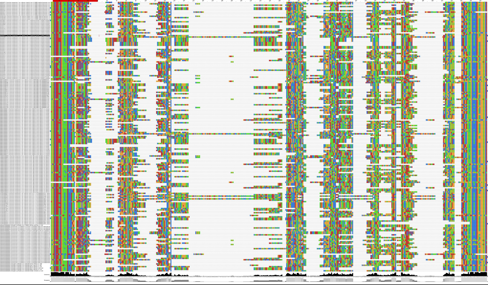
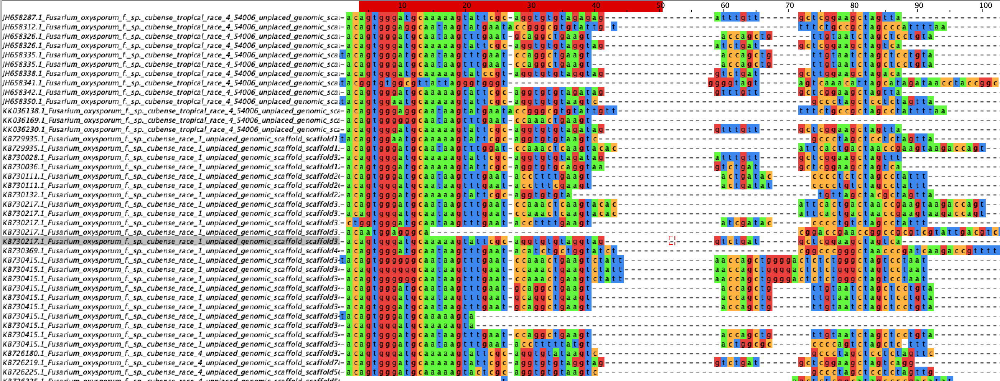
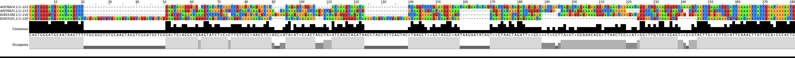
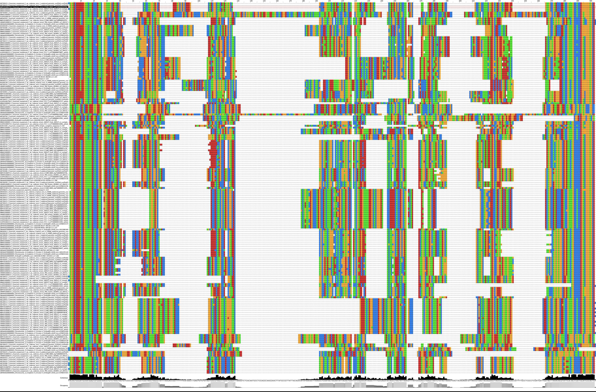
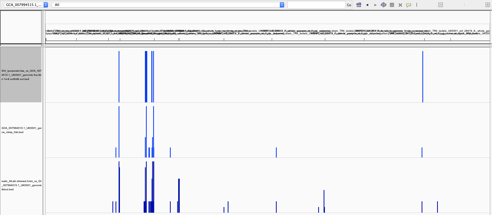
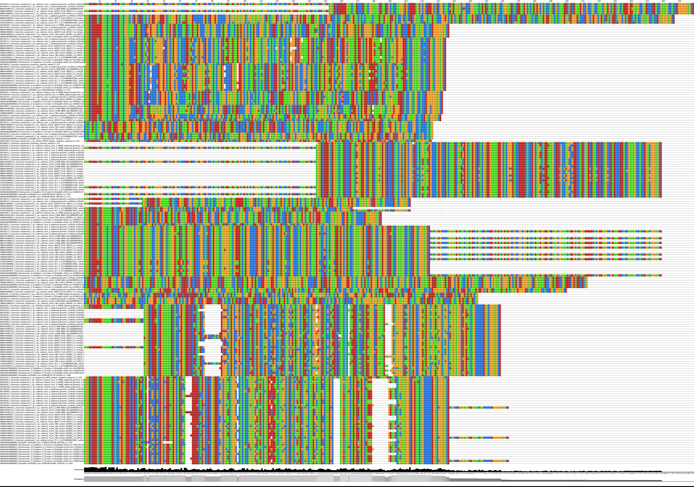
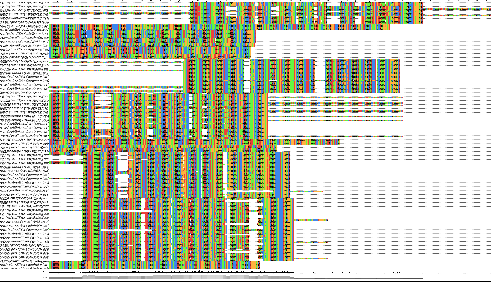
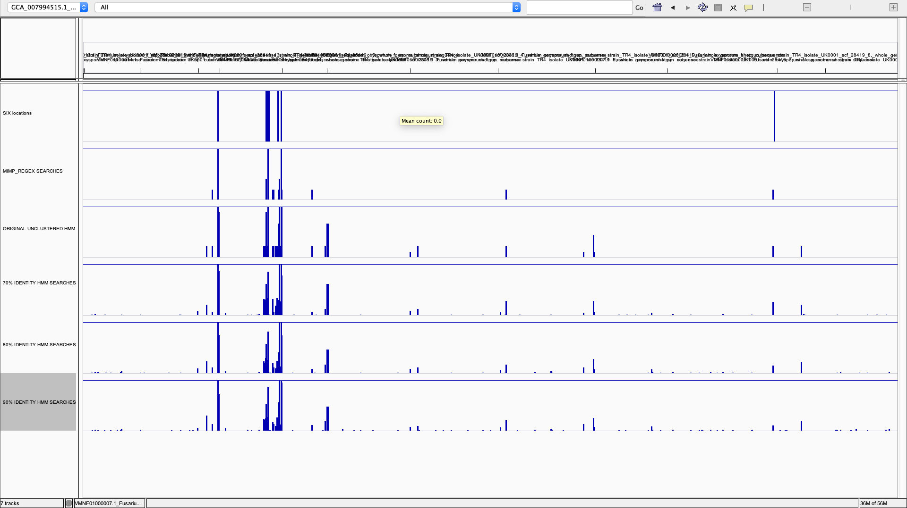
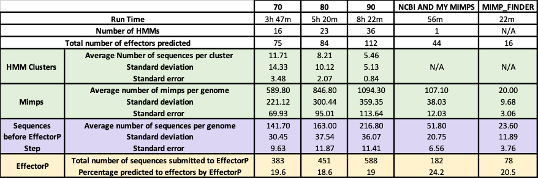

# Mimp Searching Methods

`mimps` `mimp searching`

3 Methods:

- BLASTN 
- REGEX
- HMM

Two methods of mimp searching have been used in the literature, the most common is the use of a mimp TIR as a regex. The second is BLASTN searches for mimp homologs (mimps previously identified using regex). A HMM has not been used in the literature. 

---

### BLASTN 

BLASTN – used by Chang et al., 2020 based on mimps from Van Dam et al., (2016) paper

_"Mimps have been investigated in 3 Foc strains in previous studies, but unlike the II5 (Foc tropical race 4) strain that contains 11 mimps, only 2 mimps were found in strain B2 (Foc race 4) and 0 in strain N2 (Foc race1) (van Dam et al., 2016; van Dam and Rep, 2017). To extensively exploit the mimp sequences, we searched our local genome databases of Foc 1 and Foc 4 using 13 mimp sequences collected from Foc strains II5 and B2 as queries. As a result, a total of 41 mimps (20 in Foc 1 and 21 in Foc 4) with>90 % similarity were obtained from Foc 1 and Foc 4 genomes"_

Chang et al., (2020) reported using 13 mimp sequences from the 2016 Van Dam et al paper – however I could not find these sequences and emailed Dr Chang directly asking for them.

Using a cutoff of 1e-6, and the mimp sequences Dr Chang supplied as query sequences, for BLASTN search a range of mimp homologs are identified:

|**Genome**        |**Isolate** |**Race** |**Number of BLASTN Hits**|
|------------------|------------|---------|-------------------------|
|   GCA_000149955.2|Fol 4287    |Fol      |185                      |
|  GCA_000260195.2 |FO_II5_V1   |TR4      |80                       |
| GCA_000350345.1  |Foc1_1.0_N2 |R1       |98                       |
|GCA_000350365.1   |Foc4_1.0_B2 |R4       |123                      |
|GCA_001696625.1   |C1HIR_9889  |         |104                      |
|GCA_005930515.1   |160527      |R1       |148                      |
|GCA_007994515.1   |UK0001      |TR4      |123                      |
|GCA_011316005.1   |TC1-1       |R1       |103                      |
|GWHAAST00000000   |Foc1_60     |R1       |35                       |
|GWHAASU00000000   |FocTR4_58   |TR4      |129                      |

Notes on the search can be found: /Users/u1983390/Fusarium_data/MIMPS/MIMP_BLAST_SEARCHES/Notes_On_Mimp_BLASTN_Searches.txt

BLASTN hits were then filtered based on size (hits between 200 and 400 null):

|**Genome**        |**Isolate** |**Race** |**Number of BLASTN Hits**|
|------------------|------------|---------|-------------------------|
|   GCA_000149955.2|Fol 4287    |Fol      |57                       |
|  GCA_000260195.2 |FO_II5_V1   |TR4      |33                       |
| GCA_000350345.1  |Foc1_1.0_N2 |R1       |40                       |
|GCA_000350365.1   |Foc4_1.0_B2 |R4       |42                       |
|GCA_001696625.1   |C1HIR_9889  |         |43                       |
|GCA_005930515.1   |160527      |R1       |55                       |
|GCA_007994515.1   |UK0001      |TR4      |47                       |
|GCA_011316005.1   |TC1-1       |         |37                       |
|GWHAAST00000000   |Foc1_60     |R1       |16                       |
|GWHAASU00000000   |FocTR4_58   |TR4      |45                       |

  

---

### REGEX

Alternatively, mimps can be searched using the TIR sequence. The TIR sequences (know as the regex (regular expression) is searched using custom scripts. 

Almost all mimp identification is done using REGEX searches in the literature. 

There are two mimpfinder scripts available on Github:

|**Script**                                     |**Author**|**Link**                                                                     |**Language**|**Paper**                                                                                                                                                                                                                                                                                        |
|-----------------------------------------------|----------|-----------------------------------------------------------------------------|------------|-------------------------------------------------------------------------------------------------------------------------------------------------------------------------------------------------------------------------------------------------------------------------------------------------|
|01a.mimpfinder_combine_to_putefflist_MetStop.py| Van Dam  |https://github.com/pvdam3/FoEC                                               |Python      |van Dam, P., Fokkens, L., Schmidt, S. M., Linmans, J. H. J., Kistler, H. C., Ma, L.-J., & Rep, M. (2016). Effector profiles distinguish _formae speciales�_�of _Fusarium oxysporum_. Environmental Microbiology. [http://doi.org/10.1111/1462-2920.13445](http://doi.org/10.1111/1462-2920.13445)|
|mimp_finder.pl                                 |Armitage  |https://github.com/adarmitage/pathogen/blob/master/mimp_finder/mimp_finder.pl|Perl        |https://www.nature.com/articles/s41598-018-30335-7
No Obvious paper however, I expect this one:                                                                                                                                                                                                   |

Mimpfinder – developed by Van Dam et al (2016)

Van Dam and Rep, 2017 = [https://www.ncbi.nlm.nih.gov/pmc/articles/PMC5579170](https://www.ncbi.nlm.nih.gov/pmc/articles/PMC5579170)/

Paper where the TIR in Dr Chang emailed file is from: [https://www.ars.usda.gov/ARSUserFiles/3041/2016-%20van%20Dam_Environmental_Microbiology.pdf](https://www.ars.usda.gov/ARSUserFiles/3041/2016-%20van%20Dam_Environmental_Microbiology.pdf)  _I also believe that this is the TIR used in the mimp_finder as part of FoEC.py_ 

Schmidt et al., 2013: [https://link.springer.com/article/10.1186/1471-2164-14-119](https://link.springer.com/article/10.1186/1471-2164-14-119) 

Mimp Sequences from literature: NOT AN EXHAUSTIVE SEARCH. 

NOTE: These TIRs are the same.


 Image: Bergemann _et al.,_ (2008) - [https://link.springer.com/article/10.1007%2Fs00239-008-9164-7#SecESM1](https://link.springer.com/article/10.1007%2Fs00239-008-9164-7#SecESM1) 

Regex Searches for mimps: Find files etc: VETTEL /home/u1983390/Fusarium_data/MIMPS/TIR_SEQUENCES 

| **Genome**         | **Isolate** | **Race** | **Number of hits and TIR**                               | **Number of hits and TIR**                 |
|--------------------|--------------|-----------|----------------------------------------------------------|--------------------------------------------|
|                    |              |           | Van Dam and Rep (2017) AGT[GA][GA]G[GAT][TGC]GCAA[TAG]AA | Armitage et al (2018)  CAGTGGGNNGCAA[TA]AA |
|    GCA_000149955.2 | Fol 4287     | Fol       | 58                                                       | 52                                         |
|   GCA_000260195.2  | FO_II5_V1    | TR4       | 19                                                       | 13                                         |
|  GCA_000350345.1   | Foc1_1.0_N2  | R1        | 27                                                       | 23                                         |
| GCA_000350365.1    | Foc4_1.0_B2  | R4        | 28                                                       | 20                                         |
| GCA_001696625.1    | C1HIR_9889   | R4        | 28                                                       | 21                                         |
| GCA_005930515.1    | 160527       | R1        | 41                                                       | 34                                         |
| GCA_007994515.1    | UK0001       | TR4       | 38                                                       | 27                                         |
| GCA_011316005.1    | TC1-1        | R1        | 31                                                       | 23                                         |
| GWHAAST00000000    | Foc1_60      | R1        | 5                                                        | 5                                          |
| GWHAASU00000000    | FocTR4_58    | TR4       | 38                                                       | 29                                         |

ALIGNMENTS? What do these sequences look like? Can they be clustered within the mimp families from BERGEMANN? Do they need to be?  - NEED TO USE THE SECTION OF CODE TO MAKE A FASTA FROM THE MAEI SCRIPT TO THEN USE IN JALVIEW FOR PHYLOGENTIC TREE GENERATTION. 

---

### HIDDEN MARKOV MODEL

Suggested by Dr David Studholme - not yet used in the literature for mimp searching. 

Various HMMs were built. 

Initially an HMM was built by  searching through the genomes listed in the tables above using the original mimp_finder.py script I wrote (regex: CAGTGGGNNGCAA[TA]AA). These hits were extracted and used to make an HMM:

Building an HMM for mimp searching 12/10/2020

The genome assemblies were copied to this directory (/home/u1983390/Fusarium_data/MIMPS/MIMP_hmm) from /home/u1983390/Fusarium_data/Raw_Genomes/ASSEMBLIES/GENOMIC as was the .txt file containing a list of these genomes.

Spaces and tab were removed in headers using sed.

The script find_and_extract_mimps.sh was copied from the first part of ~/Scripts/Maei.sh and run on the .txt file listing the genomes.

The mimp FASTAs were combined into one FASTA: All_mimps_comb.fna

The combined FASTA was then aligned using MAFFT: All_mimps_comb.aln.fa

The aligned sequence was then viewed in Jalview, and ends trimmed so that the sequences started at the mimp TIRs. There were not many highly conserved regions, apart from the REGEX. I think there needs to be more work done on what the transposes RF may look like in a mimp.

A new timmed file was created in Jalview saving in Stockholm Format: All_mimps_comb_trimmed.aln.sto

This was then used to build a hmm with HMMER's hmmbuild: hmmbuild --dna All_mimps_comb_trimmed.hmm All_mimps_comb_trimmed.aln.sto

The output of this was the file: All_mimps_comb_trimmed.hmm

The contig on which most mimps are found in the Assembly for UK00001 was extracted from home/u1983390/Fusarium_data/MIMPS/MIMP_hmm/GENOMES/GCA_007994515.1_UK0001_genomic.fna using samtools faidx and saved as UK0001_scf_14_hmm_test.fasta.

nhmmer was then used to search for mimps using the new hmm file on the extracted scaffold from UK0001. A .bed file was made form the output.

```
nhmmer --tblout "hmm_test.tbl" --dna  All_mimps_comb_trimmed.hmm UK0001_scf_14_hmm_test.fasta ;  awk 'BEGIN { OFS="\t" }  {print $1,$7,$8,$12}' "hmm_test.tbl" > hmm_test.bed
```

The output file from the MAFFT alignment was quite messy: 


Only the TIRs aligned well which is obvious because they're all that was searched for. 


I continued with the HMM build and search:  

The HMM built using the mimp hits from my mimp_finditer.py script found 81 mimps on scaffold 14 of the UK0001 assembly. My mimp finder found 18. None of the mimps found by the HMM share an exact location with the mimps found by mime  (see excel doc). 
[All_HMM_Search_methods_compared.xlsx](./file/All_HMM_Search_methods_compared.xlsx)

NCBI MIMPS

Publicly available mimps were considered for the construction of an HMM. 

Mimp sequences reported in the following papers were downloaded from NCBI.

    - Bergemann, M., Lespinet, O., M’Barek, S.B., Daboussi, M.J. and Dufresne, M., 2008. Genome-Wide Analysis of the Fusarium oxysporummimp Family of MITEs and Mobilization of Both Native and De Novo Created mimps. Journal of molecular evolution, 67(6), pp.631-642.
    - Hua-Van, A., Davière, J.M., Kaper, F., Langin, T. and Daboussi, M.J., 2000. Genome organization in Fusarium oxysporum: clusters of class II transposons. Current genetics, 37(5), pp.339-347.

They were combined into one FASTA and aligned using the deafult setting in MAFFT"

```
 mafft Mimp_Sequences_NCBI.fasta > Mimp_Sequences_NCBI.aln.fasta
```

The aligned file was then manually checked  in Jalview (image below), but again, didn't align very well.


The alignment was saved in Stockholm format from Jalview and then an HMM was built. 

```
hmmbuild --dna Mimp_Sequences_NCBI.hmm Mimp_Sequences_NCBI.aln.sto
```

     

The HMM was used to search Scaffold 14 of the UK0001 assembly

```
nhmmer --tblout "Mimp_Sequences_NCBI.hmm.tblout" --dna Mimp_Sequences_NCBI.hmm UK0001_scf_14_hmm_test.fast
```

A bed file was generated from the output using awk

```
awk -v OFS='\t'  '{print $1,$7,$8,$12}' Mimp_Sequences_NCBI.hmm.tblout > Mimp_Sequences_NCBI.hmm.tblout.bed
```

MY MIMPS AND NCBI MIMPS COMBINED

I decided to combine the mimps I had found with my mimp finder and the sequences from NCBI, and cluster them. 

Using NCBI Mimps and my MIMPs to build an HMM    2/11/2020

The mimp sequences downloaded from NCBI and found in: /Users/u1983390/Fusarium_data/MIMPS/MIMP_HMM/NCBI_MIMPS/Mimp_Sequences_NCBI.fasta were copied to /Users/u1983390/Fusarium_data/MIMPS/MIMP_HMM/NCBI_AND_MY_MIMPS_COMB

The mimps found from my regex search found in: /Users/u1983390/Fusarium_data/MIMPS/MIMP_HMM/MY_MIMPS/All_mimps_comb.fna were copied to /Users/u1983390/Fusarium_data/MIMPS/MIMP_HMM/NCBI_AND_MY_MIMPS_COMB as All_mimps_comb_from_my_mimp_finder_search.fna

The mimps from my regex search and those downloaded from NCBI were then merged into one FASTA file: Both_NCBI_and_my_mimps.fasta ensuring that the mimps from NCBI were the first entires in the FASTA.

This combined FASTA was then clustered using CD-HIT: 

```
	cd-hit -i ./Both_NCBI_and_my_mimps.fasta -d 0 -o ./Both_NCBI_and_my_mimps.CLUSTERED_90_perc_ident.fasta -c 0.9 -n 5  -G 1 -g 1 -b 20 -l 10 -s 0.0 -aL 0.0 -aS 0.0
```

THEN USED FOLLOWING COMMANDS :

```
awk -F"[> ]" '
BEGIN{
  OFS="_"
}
/^>/{
  close(out_file)
  out_file=$2 OFS $3
  next
}
{
  match($0,/>[^"]*/)
  print substr($0,RSTART+1) > (out_file)
}' ./Both_NCBI_and_my_mimps.CLUSTERED_90_perc_ident.fasta.clstr

#Make a directory which contains these individual cluster list file.

mkdir CLUSTERS_90_PERC_IDENT_2_11_2020
mv Cluster_* ./CLUSTERS_90_PERC_IDENT_2_11_2020/

#List all of the clusters.

ls ./CLUSTERS_90_PERC_IDENT_2_11_2020/ > Cluster_list_90_perc_ident.txt

for i in $(cat ./Cluster_list_90_perc_ident.txt); do awk -F'\\.\\.\\.' '{print $1}' ./CLUSTERS_90_PERC_IDENT_2_11_2020/${i} > ./CLUSTERS_90_PERC_IDENT_2_11_2020/${i}.final ; done

#Loop through the indiviual cluster files and generate a FASTA containing all of the sequences in that cluster.

for i in $(cat Cluster_list_90_perc_ident.txt);
  do for j in $(cat ./CLUSTERS_90_PERC_IDENT_2_11_2020/${i}.final);
    do samtools faidx ./Both_NCBI_and_my_mimps.fasta "${j}" ; done  > ./CLUSTERS_90_PERC_IDENT_2_11_2020/${i}.fasta ; done

```

These individual FASTA files were then aligned using MAFFT (default settings):

```
for i in $(cat ../Cluster_list_90_perc_ident.txt); do mafft ./${i}.fasta > ${i}.aln.fasta ; done
```

The cluster list file was then moved to the 90% identity cluster directory 

```
mv Cluster_list_90_perc_ident.txt ./CLUSTERS_90_PERC_IDENT_2_11_2020/Cluster_list_90_perc_ident.txt
```

The aligned cluster fastas were then grouped into one large FASTA: All.aln.fasta

All.aln.fasta was then aligned using MAFFT; Realn_All.aln.fasta

This FASTA was then viewed in Jalview and ends trimmed and saved as a FASTA and a .sto e.g.: realn_realn_All.aln.trimmed.hmm.tblout"All.aln.trimmed.fasta


The stockholm file was then used to build an hmm:

```
hmmbuild --dna realn_All.aln.trimmed.hmm realn_All.aln.trimmed.sto
```

The UK0001_scf_14 files were copied to the working directory /Users/u1983390/Fusarium_data/MIMPS/MIMP_HMM/NCBI_AND_MY_MIMPS_COMB from /Users/u1983390/Fusarium_data/MIMPS/MIMP_HMM/MY_MIMPS/

The HMM was then used to search the UK0001_scf_14 fasta file:

```
nhmmer --tblout "realn_All.aln.trimmed.hmm.tblout" --dna realn_All.aln.trimmed.hmm UK0001_scf_14_hmm_test.fasta
```

A bed file was also made using this search and awk:

```
nhmmer --tblout "realn_All.aln.trimmed.hmm.tblout" --dna realn_All.aln.trimmed.hmm UK0001_scf_14_hmm_test.fasta ;  awk 'BEGIN { OFS="\t" }  {print $1,$7,$8,$12}' "realn_All.aln.trimmed.hmm.tblout" > realn_All.aln.trimmed.hmm.tblout.bed
```

NHMMER was then used to search the entire genome of UK0001: GCA_007994515.1_UK0001_genomic.fna

```
nhmmer --tblout "realn_All.aln.trimmed.hmm_vs_whole_UK0001_genome.tblout" --dna realn_All.aln.trimmed.hmm GCA_007994515.1_UK0001_genomic.fna ; awk 'BEGIN { OFS="\t" }  {print $1,$7,$8,$12}' "realn_All.aln.trimmed.hmm_vs_whole_UK0001_genome.tblout" > realn_All.aln.trimmed.hmm_vs_whole_UK0001_genome.tblout.bed
```

This was then used to search all genomes.

```
for i in $(cat ./GENOMES/Fasta_list.txt); do 
nhmmer --tblout "realn_All.aln.trimmed.hmm_vs_${i}.tblout" --dna realn_All.aln.trimmed.hmm ./GENOMES/${i} ; awk 'BEGIN { OFS="\t" }  {print $1,$7,$8,$12}' "realn_All.aln.trimmed.hmm_vs_${i}.tblout" > ./WHOLE_GENOME_SEARCHES/realn_All.aln.trimmed.hmm_vs_${i}.tblout.bed ; done 
```

Fasta files were generated for mimps sequences found in all genomes (using [https://github.com/JamiePike/UsefulScripts/blob/master](https://github.com/JamiePike/UsefulScripts/blob/master)/bed2fasta.sh) 

These output fastas were then concatenated into a larger fasta file and a large bed file:

```
cat *.fasta > WHOLE_GENOME_SEARCHES_All_mimp_hits.fasta 
cat *.bed > WHOLE_GENOME_SEARCHES_All_mimp_hits.bed
```

This larger fasta file was then to generate a non-redundant set of sequences: 

```
cd-hit -i ./WHOLE_GENOME_SEARCHES_All_mimp_hits.fasta -d 0 -o ./WHOLE_GENOME_SEARCHES_All_mimp_hits.non-redundant.fasta -c 1 -n 5  -G 1 -g 1 -b 20 -l 10 -s 0.0 -aL 1 -aS 0.0
```

This set was then BLASTED using NCBI BLAST: [https://blast.ncbi.nlm.nih.gov/Blast.cgi?PROGRAM=blastn&PAGE_TYPE=BlastSearch&LINK_LOC=blasthome](https://blast.ncbi.nlm.nih.gov/Blast.cgi?PROGRAM=blastn&PAGE_TYPE=BlastSearch&LINK_LOC=blasthome)

I also compared the locations of a six gene blast search to the locations of the mimps found by the NCBI and MY MIMPs HMM search and the locations of my mimp searches:



_HMM used to search for MITES in this paper (https://academic.oup.com/gbe/article/doi/10.1093/gbe/evr098/595611) however, genomes were mined for mites first, and then an HMM built using each MITE class. They were not looking for a specific MITE in their searches, so far as I can tell, just MITES in general (See: Identification of MITEs in the E. festucae Genome Sequence)._ 

As 90% identity generated quite a messy intervening profile for the HMM. The sequences were grouped and then aligned at 90%, 80%, and 70% identity and each cluster was then turned into an HMM. 

90% Identity:

|**Cluster**|**Number of seq**|**Trimmer?**|**PNG**|**Stockholm**|**Keep?**|
|-----------|-----------------|------------|-------|-------------|---------|
|0          |5                |no          |y      |y            |         |
|1          |3                |no          |y      |y            |?        |
|2          |1                |no          |y      |y            |?        |
|3          |21               |yes         |y      |y            |         |
|4          |19               |yes         |y      |y            |         |
|5          |5                |no          |y      |y            |         |
|6          |2                |no          |y      |y            |?        |
|7          |2                |no          |y      |y            |?        |
|8          |8                |no          |y      |y            |         |
|9          |9                |no          |y      |y            |         |
|10         |4                |no          |y      |y            |         |
|11         |6                |no          |y      |y            |         |
|12         |11               |no          |y      |y            |         |
|13         |11               |no          |y      |y            |         |
|14         |1                |no          |y      |y            |?        |
|15         |6                |no          |y      |y            |         |
|16         |4                |no          |y      |y            |         |
|17         |2                |no          |y      |y            |?        |
|18         |1                |no          |y      |y            |?        |
|19         |5                |no          |y      |y            |         |
|20         |3                |no          |y      |y            |?        |
|21         |2                |no          |y      |y            |?        |
|22         |1                |no          |y      |y            |?        |
|23         |1                |no          |y      |y            |?        |
|24         |3                |no          |y      |y            |?        |
|25         |3                |no          |y      |y            |?        |
|26         |15               |no          |y      |y            |         |
|27         |7                |no          |y      |y            |         |
|28         |3                |no          |y      |y            |?        |
|29         |1                |no          |y      |y            |?        |
|30         |1                |no          |y      |y            |?        |
|31         |14               |no          |y      |y            |         |
|32         |10               |yes         |y      |y            |         |
|33         |4                |yes         |y      |y            |         |
|34         |2                |no          |y      |y            |?        |
|35         |5                |no          |y      |y            |         |
|36         |1                |no          |y      |y            |?        |

```

for i in $(cat Cluster_list_90_perc_ident.txt); do hmmbuild --dna ${i}.hmm  ${i}_aln.sto ; done
# hmmbuild :: profile HMM construction from multiple sequence alignments
# HMMER 3.3.1 (Jul 2020); http://hmmer.org/
# Copyright (C) 2020 Howard Hughes Medical Institute.
# Freely distributed under the BSD open source license.
# - - - - - - - - - - - - - - - - - - - - - - - - - - - - - - - - - - - -
# input alignment file:             Cluster_0_aln.sto
# output HMM file:                  Cluster_0.hmm
# input alignment is asserted as:   DNA
# - - - - - - - - - - - - - - - - - - - - - - - - - - - - - - - - - - - -

# idx name                  nseq  alen  mlen     W eff_nseq re/pos description
#---- -------------------- ----- ----- ----- ----- -------- ------ -----------
1     Cluster_0_aln            5   379   227   359     1.70  0.621 

# CPU time: 0.03u 0.00s 00:00:00.03 Elapsed: 00:00:00.04
# hmmbuild :: profile HMM construction from multiple sequence alignments
# HMMER 3.3.1 (Jul 2020); http://hmmer.org/
# Copyright (C) 2020 Howard Hughes Medical Institute.
# Freely distributed under the BSD open source license.
# - - - - - - - - - - - - - - - - - - - - - - - - - - - - - - - - - - - -
# input alignment file:             Cluster_1_aln.sto
# output HMM file:                  Cluster_1.hmm
# input alignment is asserted as:   DNA
# - - - - - - - - - - - - - - - - - - - - - - - - - - - - - - - - - - - -

# idx name                  nseq  alen  mlen     W eff_nseq re/pos description
#---- -------------------- ----- ----- ----- ----- -------- ------ -----------
1     Cluster_1_aln            3   367   367   525     1.70  0.620 

# CPU time: 0.05u 0.00s 00:00:00.05 Elapsed: 00:00:00.05
# hmmbuild :: profile HMM construction from multiple sequence alignments
# HMMER 3.3.1 (Jul 2020); http://hmmer.org/
# Copyright (C) 2020 Howard Hughes Medical Institute.
# Freely distributed under the BSD open source license.
# - - - - - - - - - - - - - - - - - - - - - - - - - - - - - - - - - - - -
# input alignment file:             Cluster_10_aln.sto
# output HMM file:                  Cluster_10.hmm
# input alignment is asserted as:   DNA
# - - - - - - - - - - - - - - - - - - - - - - - - - - - - - - - - - - - -

# idx name                  nseq  alen  mlen     W eff_nseq re/pos description
#---- -------------------- ----- ----- ----- ----- -------- ------ -----------
1     Cluster_10_aln           4   243   243   378     1.78  0.619 

# CPU time: 0.03u 0.00s 00:00:00.03 Elapsed: 00:00:00.03
# hmmbuild :: profile HMM construction from multiple sequence alignments
# HMMER 3.3.1 (Jul 2020); http://hmmer.org/
# Copyright (C) 2020 Howard Hughes Medical Institute.
# Freely distributed under the BSD open source license.
# - - - - - - - - - - - - - - - - - - - - - - - - - - - - - - - - - - - -
# input alignment file:             Cluster_11_aln.sto
# output HMM file:                  Cluster_11.hmm
# input alignment is asserted as:   DNA
# - - - - - - - - - - - - - - - - - - - - - - - - - - - - - - - - - - - -

# idx name                  nseq  alen  mlen     W eff_nseq re/pos description
#---- -------------------- ----- ----- ----- ----- -------- ------ -----------
1     Cluster_11_aln           6   227   227   359     1.73  0.620 

# CPU time: 0.02u 0.00s 00:00:00.02 Elapsed: 00:00:00.03
# hmmbuild :: profile HMM construction from multiple sequence alignments
# HMMER 3.3.1 (Jul 2020); http://hmmer.org/
# Copyright (C) 2020 Howard Hughes Medical Institute.
# Freely distributed under the BSD open source license.
# - - - - - - - - - - - - - - - - - - - - - - - - - - - - - - - - - - - -
# input alignment file:             Cluster_12_aln.sto
# output HMM file:                  Cluster_12.hmm
# input alignment is asserted as:   DNA
# - - - - - - - - - - - - - - - - - - - - - - - - - - - - - - - - - - - -

# idx name                  nseq  alen  mlen     W eff_nseq re/pos description
#---- -------------------- ----- ----- ----- ----- -------- ------ -----------
1     Cluster_12_aln          11   225   224   354     1.81  0.620 

# CPU time: 0.03u 0.00s 00:00:00.03 Elapsed: 00:00:00.03
# hmmbuild :: profile HMM construction from multiple sequence alignments
# HMMER 3.3.1 (Jul 2020); http://hmmer.org/
# Copyright (C) 2020 Howard Hughes Medical Institute.
# Freely distributed under the BSD open source license.
# - - - - - - - - - - - - - - - - - - - - - - - - - - - - - - - - - - - -
# input alignment file:             Cluster_13_aln.sto
# output HMM file:                  Cluster_13.hmm
# input alignment is asserted as:   DNA
# - - - - - - - - - - - - - - - - - - - - - - - - - - - - - - - - - - - -

# idx name                  nseq  alen  mlen     W eff_nseq re/pos description
#---- -------------------- ----- ----- ----- ----- -------- ------ -----------
1     Cluster_13_aln          11   225   222   351     1.87  0.621 

# CPU time: 0.03u 0.00s 00:00:00.03 Elapsed: 00:00:00.03
# hmmbuild :: profile HMM construction from multiple sequence alignments
# HMMER 3.3.1 (Jul 2020); http://hmmer.org/
# Copyright (C) 2020 Howard Hughes Medical Institute.
# Freely distributed under the BSD open source license.
# - - - - - - - - - - - - - - - - - - - - - - - - - - - - - - - - - - - -
# input alignment file:             Cluster_14_aln.sto
# output HMM file:                  Cluster_14.hmm
# input alignment is asserted as:   DNA
# - - - - - - - - - - - - - - - - - - - - - - - - - - - - - - - - - - - -

# idx name                  nseq  alen  mlen     W eff_nseq re/pos description
#---- -------------------- ----- ----- ----- ----- -------- ------ -----------
1     Cluster_14_aln           1   223   223   364     1.00  0.343 

# CPU time: 0.01u 0.00s 00:00:00.01 Elapsed: 00:00:00.02
# hmmbuild :: profile HMM construction from multiple sequence alignments
# HMMER 3.3.1 (Jul 2020); http://hmmer.org/
# Copyright (C) 2020 Howard Hughes Medical Institute.
# Freely distributed under the BSD open source license.
# - - - - - - - - - - - - - - - - - - - - - - - - - - - - - - - - - - - -
# input alignment file:             Cluster_15_aln.sto
# output HMM file:                  Cluster_15.hmm
# input alignment is asserted as:   DNA
# - - - - - - - - - - - - - - - - - - - - - - - - - - - - - - - - - - - -

# idx name                  nseq  alen  mlen     W eff_nseq re/pos description
#---- -------------------- ----- ----- ----- ----- -------- ------ -----------
1     Cluster_15_aln           6   223   223   354     1.74  0.621 

# CPU time: 0.02u 0.00s 00:00:00.02 Elapsed: 00:00:00.03
# hmmbuild :: profile HMM construction from multiple sequence alignments
# HMMER 3.3.1 (Jul 2020); http://hmmer.org/
# Copyright (C) 2020 Howard Hughes Medical Institute.
# Freely distributed under the BSD open source license.
# - - - - - - - - - - - - - - - - - - - - - - - - - - - - - - - - - - - -
# input alignment file:             Cluster_16_aln.sto
# output HMM file:                  Cluster_16.hmm
# input alignment is asserted as:   DNA
# - - - - - - - - - - - - - - - - - - - - - - - - - - - - - - - - - - - -

# idx name                  nseq  alen  mlen     W eff_nseq re/pos description
#---- -------------------- ----- ----- ----- ----- -------- ------ -----------
1     Cluster_16_aln           4   223   222   353     1.75  0.620 

# CPU time: 0.02u 0.00s 00:00:00.02 Elapsed: 00:00:00.02
# hmmbuild :: profile HMM construction from multiple sequence alignments
# HMMER 3.3.1 (Jul 2020); http://hmmer.org/
# Copyright (C) 2020 Howard Hughes Medical Institute.
# Freely distributed under the BSD open source license.
# - - - - - - - - - - - - - - - - - - - - - - - - - - - - - - - - - - - -
# input alignment file:             Cluster_17_aln.sto
# output HMM file:                  Cluster_17.hmm
# input alignment is asserted as:   DNA
# - - - - - - - - - - - - - - - - - - - - - - - - - - - - - - - - - - - -

# idx name                  nseq  alen  mlen     W eff_nseq re/pos description
#---- -------------------- ----- ----- ----- ----- -------- ------ -----------
1     Cluster_17_aln           2   222   222   353     1.70  0.621 

# CPU time: 0.02u 0.00s 00:00:00.02 Elapsed: 00:00:00.02
# hmmbuild :: profile HMM construction from multiple sequence alignments
# HMMER 3.3.1 (Jul 2020); http://hmmer.org/
# Copyright (C) 2020 Howard Hughes Medical Institute.
# Freely distributed under the BSD open source license.
# - - - - - - - - - - - - - - - - - - - - - - - - - - - - - - - - - - - -
# input alignment file:             Cluster_18_aln.sto
# output HMM file:                  Cluster_18.hmm
# input alignment is asserted as:   DNA
# - - - - - - - - - - - - - - - - - - - - - - - - - - - - - - - - - - - -

# idx name                  nseq  alen  mlen     W eff_nseq re/pos description
#---- -------------------- ----- ----- ----- ----- -------- ------ -----------
1     Cluster_18_aln           1   222   222   362     1.00  0.342 

# CPU time: 0.01u 0.00s 00:00:00.01 Elapsed: 00:00:00.02
# hmmbuild :: profile HMM construction from multiple sequence alignments
# HMMER 3.3.1 (Jul 2020); http://hmmer.org/
# Copyright (C) 2020 Howard Hughes Medical Institute.
# Freely distributed under the BSD open source license.
# - - - - - - - - - - - - - - - - - - - - - - - - - - - - - - - - - - - -
# input alignment file:             Cluster_19_aln.sto
# output HMM file:                  Cluster_19.hmm
# input alignment is asserted as:   DNA
# - - - - - - - - - - - - - - - - - - - - - - - - - - - - - - - - - - - -

# idx name                  nseq  alen  mlen     W eff_nseq re/pos description
#---- -------------------- ----- ----- ----- ----- -------- ------ -----------
1     Cluster_19_aln           5   217   217   347     1.68  0.618 

# CPU time: 0.02u 0.00s 00:00:00.02 Elapsed: 00:00:00.02
# hmmbuild :: profile HMM construction from multiple sequence alignments
# HMMER 3.3.1 (Jul 2020); http://hmmer.org/
# Copyright (C) 2020 Howard Hughes Medical Institute.
# Freely distributed under the BSD open source license.
# - - - - - - - - - - - - - - - - - - - - - - - - - - - - - - - - - - - -
# input alignment file:             Cluster_2_aln.sto
# output HMM file:                  Cluster_2.hmm
# input alignment is asserted as:   DNA
# - - - - - - - - - - - - - - - - - - - - - - - - - - - - - - - - - - - -

# idx name                  nseq  alen  mlen     W eff_nseq re/pos description
#---- -------------------- ----- ----- ----- ----- -------- ------ -----------
1     Cluster_2_aln            1   367   367   538     1.00  0.333 

# CPU time: 0.03u 0.00s 00:00:00.03 Elapsed: 00:00:00.03
# hmmbuild :: profile HMM construction from multiple sequence alignments
# HMMER 3.3.1 (Jul 2020); http://hmmer.org/
# Copyright (C) 2020 Howard Hughes Medical Institute.
# Freely distributed under the BSD open source license.
# - - - - - - - - - - - - - - - - - - - - - - - - - - - - - - - - - - - -
# input alignment file:             Cluster_20_aln.sto
# output HMM file:                  Cluster_20.hmm
# input alignment is asserted as:   DNA
# - - - - - - - - - - - - - - - - - - - - - - - - - - - - - - - - - - - -

# idx name                  nseq  alen  mlen     W eff_nseq re/pos description
#---- -------------------- ----- ----- ----- ----- -------- ------ -----------
1     Cluster_20_aln           3   217   217   347     1.68  0.620 

# CPU time: 0.02u 0.00s 00:00:00.02 Elapsed: 00:00:00.02
# hmmbuild :: profile HMM construction from multiple sequence alignments
# HMMER 3.3.1 (Jul 2020); http://hmmer.org/
# Copyright (C) 2020 Howard Hughes Medical Institute.
# Freely distributed under the BSD open source license.
# - - - - - - - - - - - - - - - - - - - - - - - - - - - - - - - - - - - -
# input alignment file:             Cluster_21_aln.sto
# output HMM file:                  Cluster_21.hmm
# input alignment is asserted as:   DNA
# - - - - - - - - - - - - - - - - - - - - - - - - - - - - - - - - - - - -

# idx name                  nseq  alen  mlen     W eff_nseq re/pos description
#---- -------------------- ----- ----- ----- ----- -------- ------ -----------
1     Cluster_21_aln           2   217   217   347     1.69  0.621 

# CPU time: 0.02u 0.00s 00:00:00.02 Elapsed: 00:00:00.02
# hmmbuild :: profile HMM construction from multiple sequence alignments
# HMMER 3.3.1 (Jul 2020); http://hmmer.org/
# Copyright (C) 2020 Howard Hughes Medical Institute.
# Freely distributed under the BSD open source license.
# - - - - - - - - - - - - - - - - - - - - - - - - - - - - - - - - - - - -
# input alignment file:             Cluster_22_aln.sto
# output HMM file:                  Cluster_22.hmm
# input alignment is asserted as:   DNA
# - - - - - - - - - - - - - - - - - - - - - - - - - - - - - - - - - - - -

# idx name                  nseq  alen  mlen     W eff_nseq re/pos description
#---- -------------------- ----- ----- ----- ----- -------- ------ -----------
1     Cluster_22_aln           1   216   216   355     1.00  0.348 

# CPU time: 0.01u 0.00s 00:00:00.01 Elapsed: 00:00:00.01
# hmmbuild :: profile HMM construction from multiple sequence alignments
# HMMER 3.3.1 (Jul 2020); http://hmmer.org/
# Copyright (C) 2020 Howard Hughes Medical Institute.
# Freely distributed under the BSD open source license.
# - - - - - - - - - - - - - - - - - - - - - - - - - - - - - - - - - - - -
# input alignment file:             Cluster_23_aln.sto
# output HMM file:                  Cluster_23.hmm
# input alignment is asserted as:   DNA
# - - - - - - - - - - - - - - - - - - - - - - - - - - - - - - - - - - - -

# idx name                  nseq  alen  mlen     W eff_nseq re/pos description
#---- -------------------- ----- ----- ----- ----- -------- ------ -----------
1     Cluster_23_aln           1   215   215   354     1.00  0.338 

# CPU time: 0.02u 0.00s 00:00:00.02 Elapsed: 00:00:00.02
# hmmbuild :: profile HMM construction from multiple sequence alignments
# HMMER 3.3.1 (Jul 2020); http://hmmer.org/
# Copyright (C) 2020 Howard Hughes Medical Institute.
# Freely distributed under the BSD open source license.
# - - - - - - - - - - - - - - - - - - - - - - - - - - - - - - - - - - - -
# input alignment file:             Cluster_24_aln.sto
# output HMM file:                  Cluster_24.hmm
# input alignment is asserted as:   DNA
# - - - - - - - - - - - - - - - - - - - - - - - - - - - - - - - - - - - -

# idx name                  nseq  alen  mlen     W eff_nseq re/pos description
#---- -------------------- ----- ----- ----- ----- -------- ------ -----------
1     Cluster_24_aln           3   215   215   345     1.67  0.619 

# CPU time: 0.03u 0.00s 00:00:00.03 Elapsed: 00:00:00.03
# hmmbuild :: profile HMM construction from multiple sequence alignments
# HMMER 3.3.1 (Jul 2020); http://hmmer.org/
# Copyright (C) 2020 Howard Hughes Medical Institute.
# Freely distributed under the BSD open source license.
# - - - - - - - - - - - - - - - - - - - - - - - - - - - - - - - - - - - -
# input alignment file:             Cluster_25_aln.sto
# output HMM file:                  Cluster_25.hmm
# input alignment is asserted as:   DNA
# - - - - - - - - - - - - - - - - - - - - - - - - - - - - - - - - - - - -

# idx name                  nseq  alen  mlen     W eff_nseq re/pos description
#---- -------------------- ----- ----- ----- ----- -------- ------ -----------
1     Cluster_25_aln           3   215   215   345     1.68  0.620 

# CPU time: 0.02u 0.00s 00:00:00.02 Elapsed: 00:00:00.02
# hmmbuild :: profile HMM construction from multiple sequence alignments
# HMMER 3.3.1 (Jul 2020); http://hmmer.org/
# Copyright (C) 2020 Howard Hughes Medical Institute.
# Freely distributed under the BSD open source license.
# - - - - - - - - - - - - - - - - - - - - - - - - - - - - - - - - - - - -
# input alignment file:             Cluster_26_aln.sto
# output HMM file:                  Cluster_26.hmm
# input alignment is asserted as:   DNA
# - - - - - - - - - - - - - - - - - - - - - - - - - - - - - - - - - - - -

# idx name                  nseq  alen  mlen     W eff_nseq re/pos description
#---- -------------------- ----- ----- ----- ----- -------- ------ -----------
1     Cluster_26_aln          15   211   207   334     1.78  0.619 

# CPU time: 0.02u 0.00s 00:00:00.02 Elapsed: 00:00:00.02
# hmmbuild :: profile HMM construction from multiple sequence alignments
# HMMER 3.3.1 (Jul 2020); http://hmmer.org/
# Copyright (C) 2020 Howard Hughes Medical Institute.
# Freely distributed under the BSD open source license.
# - - - - - - - - - - - - - - - - - - - - - - - - - - - - - - - - - - - -
# input alignment file:             Cluster_27_aln.sto
# output HMM file:                  Cluster_27.hmm
# input alignment is asserted as:   DNA
# - - - - - - - - - - - - - - - - - - - - - - - - - - - - - - - - - - - -

# idx name                  nseq  alen  mlen     W eff_nseq re/pos description
#---- -------------------- ----- ----- ----- ----- -------- ------ -----------
1     Cluster_27_aln           7   211   209   337     1.73  0.620 

# CPU time: 0.02u 0.00s 00:00:00.02 Elapsed: 00:00:00.02
# hmmbuild :: profile HMM construction from multiple sequence alignments
# HMMER 3.3.1 (Jul 2020); http://hmmer.org/
# Copyright (C) 2020 Howard Hughes Medical Institute.
# Freely distributed under the BSD open source license.
# - - - - - - - - - - - - - - - - - - - - - - - - - - - - - - - - - - - -
# input alignment file:             Cluster_28_aln.sto
# output HMM file:                  Cluster_28.hmm
# input alignment is asserted as:   DNA
# - - - - - - - - - - - - - - - - - - - - - - - - - - - - - - - - - - - -

# idx name                  nseq  alen  mlen     W eff_nseq re/pos description
#---- -------------------- ----- ----- ----- ----- -------- ------ -----------
1     Cluster_28_aln           3   208   208   336     1.68  0.620 

# CPU time: 0.02u 0.00s 00:00:00.02 Elapsed: 00:00:00.02
# hmmbuild :: profile HMM construction from multiple sequence alignments
# HMMER 3.3.1 (Jul 2020); http://hmmer.org/
# Copyright (C) 2020 Howard Hughes Medical Institute.
# Freely distributed under the BSD open source license.
# - - - - - - - - - - - - - - - - - - - - - - - - - - - - - - - - - - - -
# input alignment file:             Cluster_29_aln.sto
# output HMM file:                  Cluster_29.hmm
# input alignment is asserted as:   DNA
# - - - - - - - - - - - - - - - - - - - - - - - - - - - - - - - - - - - -

# idx name                  nseq  alen  mlen     W eff_nseq re/pos description
#---- -------------------- ----- ----- ----- ----- -------- ------ -----------
1     Cluster_29_aln           1   208   208   345     1.00  0.339 

# CPU time: 0.01u 0.00s 00:00:00.01 Elapsed: 00:00:00.01
# hmmbuild :: profile HMM construction from multiple sequence alignments
# HMMER 3.3.1 (Jul 2020); http://hmmer.org/
# Copyright (C) 2020 Howard Hughes Medical Institute.
# Freely distributed under the BSD open source license.
# - - - - - - - - - - - - - - - - - - - - - - - - - - - - - - - - - - - -
# input alignment file:             Cluster_3_aln.sto
# output HMM file:                  Cluster_3.hmm
# input alignment is asserted as:   DNA
# - - - - - - - - - - - - - - - - - - - - - - - - - - - - - - - - - - - -

# idx name                  nseq  alen  mlen     W eff_nseq re/pos description
#---- -------------------- ----- ----- ----- ----- -------- ------ -----------
1     Cluster_3_aln           21   215   215   344     1.78  0.620 

# CPU time: 0.03u 0.00s 00:00:00.03 Elapsed: 00:00:00.03
# hmmbuild :: profile HMM construction from multiple sequence alignments
# HMMER 3.3.1 (Jul 2020); http://hmmer.org/
# Copyright (C) 2020 Howard Hughes Medical Institute.
# Freely distributed under the BSD open source license.
# - - - - - - - - - - - - - - - - - - - - - - - - - - - - - - - - - - - -
# input alignment file:             Cluster_30_aln.sto
# output HMM file:                  Cluster_30.hmm
# input alignment is asserted as:   DNA
# - - - - - - - - - - - - - - - - - - - - - - - - - - - - - - - - - - - -

# idx name                  nseq  alen  mlen     W eff_nseq re/pos description
#---- -------------------- ----- ----- ----- ----- -------- ------ -----------
1     Cluster_30_aln           1   208   208   345     1.00  0.338 

# CPU time: 0.02u 0.00s 00:00:00.02 Elapsed: 00:00:00.02
# hmmbuild :: profile HMM construction from multiple sequence alignments
# HMMER 3.3.1 (Jul 2020); http://hmmer.org/
# Copyright (C) 2020 Howard Hughes Medical Institute.
# Freely distributed under the BSD open source license.
# - - - - - - - - - - - - - - - - - - - - - - - - - - - - - - - - - - - -
# input alignment file:             Cluster_31_aln.sto
# output HMM file:                  Cluster_31.hmm
# input alignment is asserted as:   DNA
# - - - - - - - - - - - - - - - - - - - - - - - - - - - - - - - - - - - -

# idx name                  nseq  alen  mlen     W eff_nseq re/pos description
#---- -------------------- ----- ----- ----- ----- -------- ------ -----------
1     Cluster_31_aln          14   209   203   331     1.78  0.621 

# CPU time: 0.03u 0.00s 00:00:00.03 Elapsed: 00:00:00.03
# hmmbuild :: profile HMM construction from multiple sequence alignments
# HMMER 3.3.1 (Jul 2020); http://hmmer.org/
# Copyright (C) 2020 Howard Hughes Medical Institute.
# Freely distributed under the BSD open source license.
# - - - - - - - - - - - - - - - - - - - - - - - - - - - - - - - - - - - -
# input alignment file:             Cluster_32_aln.sto
# output HMM file:                  Cluster_32.hmm
# input alignment is asserted as:   DNA
# - - - - - - - - - - - - - - - - - - - - - - - - - - - - - - - - - - - -

# idx name                  nseq  alen  mlen     W eff_nseq re/pos description
#---- -------------------- ----- ----- ----- ----- -------- ------ -----------
1     Cluster_32_aln          10   208   207   334     1.80  0.620 

# CPU time: 0.02u 0.00s 00:00:00.02 Elapsed: 00:00:00.02
# hmmbuild :: profile HMM construction from multiple sequence alignments
# HMMER 3.3.1 (Jul 2020); http://hmmer.org/
# Copyright (C) 2020 Howard Hughes Medical Institute.
# Freely distributed under the BSD open source license.
# - - - - - - - - - - - - - - - - - - - - - - - - - - - - - - - - - - - -
# input alignment file:             Cluster_33_aln.sto
# output HMM file:                  Cluster_33.hmm
# input alignment is asserted as:   DNA
# - - - - - - - - - - - - - - - - - - - - - - - - - - - - - - - - - - - -

# idx name                  nseq  alen  mlen     W eff_nseq re/pos description
#---- -------------------- ----- ----- ----- ----- -------- ------ -----------
1     Cluster_33_aln           4   167   167   286     1.68  0.619 

# CPU time: 0.02u 0.00s 00:00:00.02 Elapsed: 00:00:00.02
# hmmbuild :: profile HMM construction from multiple sequence alignments
# HMMER 3.3.1 (Jul 2020); http://hmmer.org/
# Copyright (C) 2020 Howard Hughes Medical Institute.
# Freely distributed under the BSD open source license.
# - - - - - - - - - - - - - - - - - - - - - - - - - - - - - - - - - - - -
# input alignment file:             Cluster_34_aln.sto
# output HMM file:                  Cluster_34.hmm
# input alignment is asserted as:   DNA
# - - - - - - - - - - - - - - - - - - - - - - - - - - - - - - - - - - - -

# idx name                  nseq  alen  mlen     W eff_nseq re/pos description
#---- -------------------- ----- ----- ----- ----- -------- ------ -----------
1     Cluster_34_aln           2   167   167   286     1.68  0.619 

# CPU time: 0.02u 0.00s 00:00:00.02 Elapsed: 00:00:00.02
# hmmbuild :: profile HMM construction from multiple sequence alignments
# HMMER 3.3.1 (Jul 2020); http://hmmer.org/
# Copyright (C) 2020 Howard Hughes Medical Institute.
# Freely distributed under the BSD open source license.
# - - - - - - - - - - - - - - - - - - - - - - - - - - - - - - - - - - - -
# input alignment file:             Cluster_35_aln.sto
# output HMM file:                  Cluster_35.hmm
# input alignment is asserted as:   DNA
# - - - - - - - - - - - - - - - - - - - - - - - - - - - - - - - - - - - -

# idx name                  nseq  alen  mlen     W eff_nseq re/pos description
#---- -------------------- ----- ----- ----- ----- -------- ------ -----------
1     Cluster_35_aln           5   185   185   308     1.68  0.620 

# CPU time: 0.02u 0.00s 00:00:00.02 Elapsed: 00:00:00.02
# hmmbuild :: profile HMM construction from multiple sequence alignments
# HMMER 3.3.1 (Jul 2020); http://hmmer.org/
# Copyright (C) 2020 Howard Hughes Medical Institute.
# Freely distributed under the BSD open source license.
# - - - - - - - - - - - - - - - - - - - - - - - - - - - - - - - - - - - -
# input alignment file:             Cluster_36_aln.sto
# output HMM file:                  Cluster_36.hmm
# input alignment is asserted as:   DNA
# - - - - - - - - - - - - - - - - - - - - - - - - - - - - - - - - - - - -

# idx name                  nseq  alen  mlen     W eff_nseq re/pos description
#---- -------------------- ----- ----- ----- ----- -------- ------ -----------
1     Cluster_36_aln           1   185   185   316     1.00  0.340 

# CPU time: 0.01u 0.00s 00:00:00.01 Elapsed: 00:00:00.01
# hmmbuild :: profile HMM construction from multiple sequence alignments
# HMMER 3.3.1 (Jul 2020); http://hmmer.org/
# Copyright (C) 2020 Howard Hughes Medical Institute.
# Freely distributed under the BSD open source license.
# - - - - - - - - - - - - - - - - - - - - - - - - - - - - - - - - - - - -
# input alignment file:             Cluster_4_aln.sto
# output HMM file:                  Cluster_4.hmm
# input alignment is asserted as:   DNA
# - - - - - - - - - - - - - - - - - - - - - - - - - - - - - - - - - - - -

# idx name                  nseq  alen  mlen     W eff_nseq re/pos description
#---- -------------------- ----- ----- ----- ----- -------- ------ -----------
1     Cluster_4_aln           19   215   215   344     1.74  0.620 

# CPU time: 0.03u 0.00s 00:00:00.03 Elapsed: 00:00:00.03
# hmmbuild :: profile HMM construction from multiple sequence alignments
# HMMER 3.3.1 (Jul 2020); http://hmmer.org/
# Copyright (C) 2020 Howard Hughes Medical Institute.
# Freely distributed under the BSD open source license.
# - - - - - - - - - - - - - - - - - - - - - - - - - - - - - - - - - - - -
# input alignment file:             Cluster_5_aln.sto
# output HMM file:                  Cluster_5.hmm
# input alignment is asserted as:   DNA
# - - - - - - - - - - - - - - - - - - - - - - - - - - - - - - - - - - - -

# idx name                  nseq  alen  mlen     W eff_nseq re/pos description
#---- -------------------- ----- ----- ----- ----- -------- ------ -----------
1     Cluster_5_aln            5   313   313   462     1.66  0.619 

# CPU time: 0.03u 0.00s 00:00:00.03 Elapsed: 00:00:00.04
# hmmbuild :: profile HMM construction from multiple sequence alignments
# HMMER 3.3.1 (Jul 2020); http://hmmer.org/
# Copyright (C) 2020 Howard Hughes Medical Institute.
# Freely distributed under the BSD open source license.
# - - - - - - - - - - - - - - - - - - - - - - - - - - - - - - - - - - - -
# input alignment file:             Cluster_6_aln.sto
# output HMM file:                  Cluster_6.hmm
# input alignment is asserted as:   DNA
# - - - - - - - - - - - - - - - - - - - - - - - - - - - - - - - - - - - -

# idx name                  nseq  alen  mlen     W eff_nseq re/pos description
#---- -------------------- ----- ----- ----- ----- -------- ------ -----------
1     Cluster_6_aln            2   300   300   447     1.68  0.620 

# CPU time: 0.03u 0.00s 00:00:00.03 Elapsed: 00:00:00.03
# hmmbuild :: profile HMM construction from multiple sequence alignments
# HMMER 3.3.1 (Jul 2020); http://hmmer.org/
# Copyright (C) 2020 Howard Hughes Medical Institute.
# Freely distributed under the BSD open source license.
# - - - - - - - - - - - - - - - - - - - - - - - - - - - - - - - - - - - -
# input alignment file:             Cluster_7_aln.sto
# output HMM file:                  Cluster_7.hmm
# input alignment is asserted as:   DNA
# - - - - - - - - - - - - - - - - - - - - - - - - - - - - - - - - - - - -

# idx name                  nseq  alen  mlen     W eff_nseq re/pos description
#---- -------------------- ----- ----- ----- ----- -------- ------ -----------
1     Cluster_7_aln            2   245   245   381     1.67  0.620 

# CPU time: 0.03u 0.00s 00:00:00.03 Elapsed: 00:00:00.04
# hmmbuild :: profile HMM construction from multiple sequence alignments
# HMMER 3.3.1 (Jul 2020); http://hmmer.org/
# Copyright (C) 2020 Howard Hughes Medical Institute.
# Freely distributed under the BSD open source license.
# - - - - - - - - - - - - - - - - - - - - - - - - - - - - - - - - - - - -
# input alignment file:             Cluster_8_aln.sto
# output HMM file:                  Cluster_8.hmm
# input alignment is asserted as:   DNA
# - - - - - - - - - - - - - - - - - - - - - - - - - - - - - - - - - - - -

# idx name                  nseq  alen  mlen     W eff_nseq re/pos description
#---- -------------------- ----- ----- ----- ----- -------- ------ -----------
1     Cluster_8_aln            3   245   245   381     1.68  0.621 

# CPU time: 0.03u 0.00s 00:00:00.03 Elapsed: 00:00:00.03
# hmmbuild :: profile HMM construction from multiple sequence alignments
# HMMER 3.3.1 (Jul 2020); http://hmmer.org/
# Copyright (C) 2020 Howard Hughes Medical Institute.
# Freely distributed under the BSD open source license.
# - - - - - - - - - - - - - - - - - - - - - - - - - - - - - - - - - - - -
# input alignment file:             Cluster_9_aln.sto
# output HMM file:                  Cluster_9.hmm
# input alignment is asserted as:   DNA
# - - - - - - - - - - - - - - - - - - - - - - - - - - - - - - - - - - - -

# idx name                  nseq  alen  mlen     W eff_nseq re/pos description
#---- -------------------- ----- ----- ----- ----- -------- ------ -----------
1     Cluster_9_aln            9   243   243   378     1.86  0.619 

# CPU time: 0.03u 0.00s 00:00:00.03 Elapsed: 00:00:00.03
```

80% identity:



Each cluster within 80% identity was saved as a PNG and STO using Jalview. 

|Table x: The number of sequences per cluster, whether the alignment was trimmed to generate the stockholm file, and the file types that were made from the trimmed (if trimmed) alignment. |                 |            |       |             |         |
|-------------------------------------------------------------------------------------------------------------------------------------------------------------------------------------------|-----------------|------------|-------|-------------|---------|
|**Cluster**                                                                                                                                                                                |**Number of seq**|**Trimmer?**|**PNG**|**Stockholm**|**Keep?**|
|0                                                                                                                                                                                          |5                |YES         |Y      |Y            |         |
|1                                                                                                                                                                                          |4                |NO          |Y      |Y            |         |
|2                                                                                                                                                                                          |24               |YES         |Y      |Y            |         |
|3                                                                                                                                                                                          |22               |YES         |Y      |Y            |         |
|4                                                                                                                                                                                          |5                |NO          |Y      |Y            |         |
|5                                                                                                                                                                                          |2                |NO          |Y      |Y            |?        |
|6                                                                                                                                                                                          |2                |NO          |Y      |Y            |?        |
|7                                                                                                                                                                                          |3                |NO          |Y      |Y            |?        |
|8                                                                                                                                                                                          |31               |YES         |Y      |Y            |         |
|9                                                                                                                                                                                          |38               |YES         |Y      |Y            |         |
|10                                                                                                                                                                                         |6                |NO          |Y      |Y            |         |
|11                                                                                                                                                                                         |11               |NO          |Y      |Y            |         |
|12                                                                                                                                                                                         |12               |NO          |Y      |Y            |         |
|13                                                                                                                                                                                         |6                |NO          |Y      |Y            |         |
|14                                                                                                                                                                                         |4                |NO          |Y      |Y            |         |
|15                                                                                                                                                                                         |2                |NO          |Y      |Y            |?        |
|16                                                                                                                                                                                         |1                |NO          |Y      |Y            |?        |
|17                                                                                                                                                                                         |5                |NO          |Y      |Y            |         |
|18                                                                                                                                                                                         |3                |NO          |Y      |Y            |?        |
|19                                                                                                                                                                                         |1                |NO          |Y      |Y            |?        |
|20                                                                                                                                                                                         |4                |YES         |Y      |Y            |         |
|21                                                                                                                                                                                         |2                |NO          |Y      |Y            |?        |
|22                                                                                                                                                                                         |3                |NO          |Y      |Y            |?        |
|23                                                                                                                                                                                         |1                |NO          |Y      |Y            |?        |

Profile HMMs were then built using the stockholm files:

```
for i in $(cat Cluster_list_80_perc_ident.txt); do hmmbuild --dna ${i}.hmm  ${i}_aln.sto ; done
# hmmbuild :: profile HMM construction from multiple sequence alignments
# HMMER 3.3.1 (Jul 2020); http://hmmer.org/
# Copyright (C) 2020 Howard Hughes Medical Institute.
# Freely distributed under the BSD open source license.
# - - - - - - - - - - - - - - - - - - - - - - - - - - - - - - - - - - - -
# input alignment file:             Cluster_0_aln.sto
# output HMM file:                  Cluster_0.hmm
# input alignment is asserted as:   DNA
# - - - - - - - - - - - - - - - - - - - - - - - - - - - - - - - - - - - -

# idx name                  nseq  alen  mlen     W eff_nseq re/pos description
#---- -------------------- ----- ----- ----- ----- -------- ------ -----------
1     Cluster_0_aln            5   227   227   359     1.70  0.621 

# CPU time: 0.03u 0.00s 00:00:00.03 Elapsed: 00:00:00.04
# hmmbuild :: profile HMM construction from multiple sequence alignments
# HMMER 3.3.1 (Jul 2020); http://hmmer.org/
# Copyright (C) 2020 Howard Hughes Medical Institute.
# Freely distributed under the BSD open source license.
# - - - - - - - - - - - - - - - - - - - - - - - - - - - - - - - - - - - -
# input alignment file:             Cluster_1_aln.sto
# output HMM file:                  Cluster_1.hmm
# input alignment is asserted as:   DNA
# - - - - - - - - - - - - - - - - - - - - - - - - - - - - - - - - - - - -

# idx name                  nseq  alen  mlen     W eff_nseq re/pos description
#---- -------------------- ----- ----- ----- ----- -------- ------ -----------
1     Cluster_1_aln            4   367   367   524     1.82  0.619 

# CPU time: 0.05u 0.00s 00:00:00.05 Elapsed: 00:00:00.05
# hmmbuild :: profile HMM construction from multiple sequence alignments
# HMMER 3.3.1 (Jul 2020); http://hmmer.org/
# Copyright (C) 2020 Howard Hughes Medical Institute.
# Freely distributed under the BSD open source license.
# - - - - - - - - - - - - - - - - - - - - - - - - - - - - - - - - - - - -
# input alignment file:             Cluster_10_aln.sto
# output HMM file:                  Cluster_10.hmm
# input alignment is asserted as:   DNA
# - - - - - - - - - - - - - - - - - - - - - - - - - - - - - - - - - - - -

# idx name                  nseq  alen  mlen     W eff_nseq re/pos description
#---- -------------------- ----- ----- ----- ----- -------- ------ -----------
1     Cluster_10_aln           6   227   227   359     1.73  0.620 

# CPU time: 0.02u 0.00s 00:00:00.02 Elapsed: 00:00:00.02
# hmmbuild :: profile HMM construction from multiple sequence alignments
# HMMER 3.3.1 (Jul 2020); http://hmmer.org/
# Copyright (C) 2020 Howard Hughes Medical Institute.
# Freely distributed under the BSD open source license.
# - - - - - - - - - - - - - - - - - - - - - - - - - - - - - - - - - - - -
# input alignment file:             Cluster_11_aln.sto
# output HMM file:                  Cluster_11.hmm
# input alignment is asserted as:   DNA
# - - - - - - - - - - - - - - - - - - - - - - - - - - - - - - - - - - - -

# idx name                  nseq  alen  mlen     W eff_nseq re/pos description
#---- -------------------- ----- ----- ----- ----- -------- ------ -----------
1     Cluster_11_aln          11   225   224   354     1.81  0.620 

# CPU time: 0.03u 0.00s 00:00:00.03 Elapsed: 00:00:00.03
# hmmbuild :: profile HMM construction from multiple sequence alignments
# HMMER 3.3.1 (Jul 2020); http://hmmer.org/
# Copyright (C) 2020 Howard Hughes Medical Institute.
# Freely distributed under the BSD open source license.
# - - - - - - - - - - - - - - - - - - - - - - - - - - - - - - - - - - - -
# input alignment file:             Cluster_12_aln.sto
# output HMM file:                  Cluster_12.hmm
# input alignment is asserted as:   DNA
# - - - - - - - - - - - - - - - - - - - - - - - - - - - - - - - - - - - -

# idx name                  nseq  alen  mlen     W eff_nseq re/pos description
#---- -------------------- ----- ----- ----- ----- -------- ------ -----------
1     Cluster_12_aln          12   225   224   352     1.93  0.619 

# CPU time: 0.03u 0.00s 00:00:00.03 Elapsed: 00:00:00.03
# hmmbuild :: profile HMM construction from multiple sequence alignments
# HMMER 3.3.1 (Jul 2020); http://hmmer.org/
# Copyright (C) 2020 Howard Hughes Medical Institute.
# Freely distributed under the BSD open source license.
# - - - - - - - - - - - - - - - - - - - - - - - - - - - - - - - - - - - -
# input alignment file:             Cluster_13_aln.sto
# output HMM file:                  Cluster_13.hmm
# input alignment is asserted as:   DNA
# - - - - - - - - - - - - - - - - - - - - - - - - - - - - - - - - - - - -

# idx name                  nseq  alen  mlen     W eff_nseq re/pos description
#---- -------------------- ----- ----- ----- ----- -------- ------ -----------
1     Cluster_13_aln           6   223   223   354     1.74  0.621 

# CPU time: 0.02u 0.00s 00:00:00.02 Elapsed: 00:00:00.02
# hmmbuild :: profile HMM construction from multiple sequence alignments
# HMMER 3.3.1 (Jul 2020); http://hmmer.org/
# Copyright (C) 2020 Howard Hughes Medical Institute.
# Freely distributed under the BSD open source license.
# - - - - - - - - - - - - - - - - - - - - - - - - - - - - - - - - - - - -
# input alignment file:             Cluster_14_aln.sto
# output HMM file:                  Cluster_14.hmm
# input alignment is asserted as:   DNA
# - - - - - - - - - - - - - - - - - - - - - - - - - - - - - - - - - - - -

# idx name                  nseq  alen  mlen     W eff_nseq re/pos description
#---- -------------------- ----- ----- ----- ----- -------- ------ -----------
1     Cluster_14_aln           4   223   222   353     1.75  0.620 

# CPU time: 0.02u 0.00s 00:00:00.02 Elapsed: 00:00:00.02
# hmmbuild :: profile HMM construction from multiple sequence alignments
# HMMER 3.3.1 (Jul 2020); http://hmmer.org/
# Copyright (C) 2020 Howard Hughes Medical Institute.
# Freely distributed under the BSD open source license.
# - - - - - - - - - - - - - - - - - - - - - - - - - - - - - - - - - - - -
# input alignment file:             Cluster_15_aln.sto
# output HMM file:                  Cluster_15.hmm
# input alignment is asserted as:   DNA
# - - - - - - - - - - - - - - - - - - - - - - - - - - - - - - - - - - - -

# idx name                  nseq  alen  mlen     W eff_nseq re/pos description
#---- -------------------- ----- ----- ----- ----- -------- ------ -----------
1     Cluster_15_aln           2   222   222   353     1.70  0.621 

# CPU time: 0.02u 0.00s 00:00:00.02 Elapsed: 00:00:00.02
# hmmbuild :: profile HMM construction from multiple sequence alignments
# HMMER 3.3.1 (Jul 2020); http://hmmer.org/
# Copyright (C) 2020 Howard Hughes Medical Institute.
# Freely distributed under the BSD open source license.
# - - - - - - - - - - - - - - - - - - - - - - - - - - - - - - - - - - - -
# input alignment file:             Cluster_16_aln.sto
# output HMM file:                  Cluster_16.hmm
# input alignment is asserted as:   DNA
# - - - - - - - - - - - - - - - - - - - - - - - - - - - - - - - - - - - -

# idx name                  nseq  alen  mlen     W eff_nseq re/pos description
#---- -------------------- ----- ----- ----- ----- -------- ------ -----------
1     Cluster_16_aln           1   222   222   362     1.00  0.342 

# CPU time: 0.01u 0.00s 00:00:00.01 Elapsed: 00:00:00.01
# hmmbuild :: profile HMM construction from multiple sequence alignments
# HMMER 3.3.1 (Jul 2020); http://hmmer.org/
# Copyright (C) 2020 Howard Hughes Medical Institute.
# Freely distributed under the BSD open source license.
# - - - - - - - - - - - - - - - - - - - - - - - - - - - - - - - - - - - -
# input alignment file:             Cluster_17_aln.sto
# output HMM file:                  Cluster_17.hmm
# input alignment is asserted as:   DNA
# - - - - - - - - - - - - - - - - - - - - - - - - - - - - - - - - - - - -

# idx name                  nseq  alen  mlen     W eff_nseq re/pos description
#---- -------------------- ----- ----- ----- ----- -------- ------ -----------
1     Cluster_17_aln           5   217   217   347     1.68  0.618 

# CPU time: 0.02u 0.00s 00:00:00.02 Elapsed: 00:00:00.02
# hmmbuild :: profile HMM construction from multiple sequence alignments
# HMMER 3.3.1 (Jul 2020); http://hmmer.org/
# Copyright (C) 2020 Howard Hughes Medical Institute.
# Freely distributed under the BSD open source license.
# - - - - - - - - - - - - - - - - - - - - - - - - - - - - - - - - - - - -
# input alignment file:             Cluster_18_aln.sto
# output HMM file:                  Cluster_18.hmm
# input alignment is asserted as:   DNA
# - - - - - - - - - - - - - - - - - - - - - - - - - - - - - - - - - - - -

# idx name                  nseq  alen  mlen     W eff_nseq re/pos description
#---- -------------------- ----- ----- ----- ----- -------- ------ -----------
1     Cluster_18_aln           3   217   217   347     1.68  0.620 

# CPU time: 0.02u 0.00s 00:00:00.02 Elapsed: 00:00:00.02
# hmmbuild :: profile HMM construction from multiple sequence alignments
# HMMER 3.3.1 (Jul 2020); http://hmmer.org/
# Copyright (C) 2020 Howard Hughes Medical Institute.
# Freely distributed under the BSD open source license.
# - - - - - - - - - - - - - - - - - - - - - - - - - - - - - - - - - - - -
# input alignment file:             Cluster_19_aln.sto
# output HMM file:                  Cluster_19.hmm
# input alignment is asserted as:   DNA
# - - - - - - - - - - - - - - - - - - - - - - - - - - - - - - - - - - - -

# idx name                  nseq  alen  mlen     W eff_nseq re/pos description
#---- -------------------- ----- ----- ----- ----- -------- ------ -----------
1     Cluster_19_aln           1   216   216   355     1.00  0.348 

# CPU time: 0.01u 0.00s 00:00:00.01 Elapsed: 00:00:00.01
# hmmbuild :: profile HMM construction from multiple sequence alignments
# HMMER 3.3.1 (Jul 2020); http://hmmer.org/
# Copyright (C) 2020 Howard Hughes Medical Institute.
# Freely distributed under the BSD open source license.
# - - - - - - - - - - - - - - - - - - - - - - - - - - - - - - - - - - - -
# input alignment file:             Cluster_2_aln.sto
# output HMM file:                  Cluster_2.hmm
# input alignment is asserted as:   DNA
# - - - - - - - - - - - - - - - - - - - - - - - - - - - - - - - - - - - -

# idx name                  nseq  alen  mlen     W eff_nseq re/pos description
#---- -------------------- ----- ----- ----- ----- -------- ------ -----------
1     Cluster_2_aln           24   215   215   343     1.84  0.619 

# CPU time: 0.03u 0.00s 00:00:00.03 Elapsed: 00:00:00.03
# hmmbuild :: profile HMM construction from multiple sequence alignments
# HMMER 3.3.1 (Jul 2020); http://hmmer.org/
# Copyright (C) 2020 Howard Hughes Medical Institute.
# Freely distributed under the BSD open source license.
# - - - - - - - - - - - - - - - - - - - - - - - - - - - - - - - - - - - -
# input alignment file:             Cluster_20_aln.sto
# output HMM file:                  Cluster_20.hmm
# input alignment is asserted as:   DNA
# - - - - - - - - - - - - - - - - - - - - - - - - - - - - - - - - - - - -

# idx name                  nseq  alen  mlen     W eff_nseq re/pos description
#---- -------------------- ----- ----- ----- ----- -------- ------ -----------
1     Cluster_20_aln           4   167   167   286     1.68  0.619 

# CPU time: 0.02u 0.00s 00:00:00.02 Elapsed: 00:00:00.02
# hmmbuild :: profile HMM construction from multiple sequence alignments
# HMMER 3.3.1 (Jul 2020); http://hmmer.org/
# Copyright (C) 2020 Howard Hughes Medical Institute.
# Freely distributed under the BSD open source license.
# - - - - - - - - - - - - - - - - - - - - - - - - - - - - - - - - - - - -
# input alignment file:             Cluster_21_aln.sto
# output HMM file:                  Cluster_21.hmm
# input alignment is asserted as:   DNA
# - - - - - - - - - - - - - - - - - - - - - - - - - - - - - - - - - - - -

# idx name                  nseq  alen  mlen     W eff_nseq re/pos description
#---- -------------------- ----- ----- ----- ----- -------- ------ -----------
1     Cluster_21_aln           2   203   203   329     1.86  0.619 

# CPU time: 0.02u 0.00s 00:00:00.02 Elapsed: 00:00:00.02
# hmmbuild :: profile HMM construction from multiple sequence alignments
# HMMER 3.3.1 (Jul 2020); http://hmmer.org/
# Copyright (C) 2020 Howard Hughes Medical Institute.
# Freely distributed under the BSD open source license.
# - - - - - - - - - - - - - - - - - - - - - - - - - - - - - - - - - - - -
# input alignment file:             Cluster_22_aln.sto
# output HMM file:                  Cluster_22.hmm
# input alignment is asserted as:   DNA
# - - - - - - - - - - - - - - - - - - - - - - - - - - - - - - - - - - - -

# idx name                  nseq  alen  mlen     W eff_nseq re/pos description
#---- -------------------- ----- ----- ----- ----- -------- ------ -----------
1     Cluster_22_aln           5   185   185   308     1.68  0.620 

# CPU time: 0.02u 0.00s 00:00:00.02 Elapsed: 00:00:00.02
# hmmbuild :: profile HMM construction from multiple sequence alignments
# HMMER 3.3.1 (Jul 2020); http://hmmer.org/
# Copyright (C) 2020 Howard Hughes Medical Institute.
# Freely distributed under the BSD open source license.
# - - - - - - - - - - - - - - - - - - - - - - - - - - - - - - - - - - - -
# input alignment file:             Cluster_23_aln.sto
# output HMM file:                  Cluster_23.hmm
# input alignment is asserted as:   DNA
# - - - - - - - - - - - - - - - - - - - - - - - - - - - - - - - - - - - -

# idx name                  nseq  alen  mlen     W eff_nseq re/pos description
#---- -------------------- ----- ----- ----- ----- -------- ------ -----------
1     Cluster_23_aln           1   185   185   316     1.00  0.340 

# CPU time: 0.01u 0.00s 00:00:00.01 Elapsed: 00:00:00.01
# hmmbuild :: profile HMM construction from multiple sequence alignments
# HMMER 3.3.1 (Jul 2020); http://hmmer.org/
# Copyright (C) 2020 Howard Hughes Medical Institute.
# Freely distributed under the BSD open source license.
# - - - - - - - - - - - - - - - - - - - - - - - - - - - - - - - - - - - -
# input alignment file:             Cluster_3_aln.sto
# output HMM file:                  Cluster_3.hmm
# input alignment is asserted as:   DNA
# - - - - - - - - - - - - - - - - - - - - - - - - - - - - - - - - - - - -

# idx name                  nseq  alen  mlen     W eff_nseq re/pos description
#---- -------------------- ----- ----- ----- ----- -------- ------ -----------
1     Cluster_3_aln           22   215   215   343     1.84  0.620 

# CPU time: 0.03u 0.00s 00:00:00.03 Elapsed: 00:00:00.03
# hmmbuild :: profile HMM construction from multiple sequence alignments
# HMMER 3.3.1 (Jul 2020); http://hmmer.org/
# Copyright (C) 2020 Howard Hughes Medical Institute.
# Freely distributed under the BSD open source license.
# - - - - - - - - - - - - - - - - - - - - - - - - - - - - - - - - - - - -
# input alignment file:             Cluster_4_aln.sto
# output HMM file:                  Cluster_4.hmm
# input alignment is asserted as:   DNA
# - - - - - - - - - - - - - - - - - - - - - - - - - - - - - - - - - - - -

# idx name                  nseq  alen  mlen     W eff_nseq re/pos description
#---- -------------------- ----- ----- ----- ----- -------- ------ -----------
1     Cluster_4_aln            5   313   313   462     1.66  0.619 

# CPU time: 0.03u 0.00s 00:00:00.03 Elapsed: 00:00:00.03
# hmmbuild :: profile HMM construction from multiple sequence alignments
# HMMER 3.3.1 (Jul 2020); http://hmmer.org/
# Copyright (C) 2020 Howard Hughes Medical Institute.
# Freely distributed under the BSD open source license.
# - - - - - - - - - - - - - - - - - - - - - - - - - - - - - - - - - - - -
# input alignment file:             Cluster_5_aln.sto
# output HMM file:                  Cluster_5.hmm
# input alignment is asserted as:   DNA
# - - - - - - - - - - - - - - - - - - - - - - - - - - - - - - - - - - - -

# idx name                  nseq  alen  mlen     W eff_nseq re/pos description
#---- -------------------- ----- ----- ----- ----- -------- ------ -----------
1     Cluster_5_aln            2   300   300   447     1.68  0.620 

# CPU time: 0.03u 0.00s 00:00:00.03 Elapsed: 00:00:00.03
# hmmbuild :: profile HMM construction from multiple sequence alignments
# HMMER 3.3.1 (Jul 2020); http://hmmer.org/
# Copyright (C) 2020 Howard Hughes Medical Institute.
# Freely distributed under the BSD open source license.
# - - - - - - - - - - - - - - - - - - - - - - - - - - - - - - - - - - - -
# input alignment file:             Cluster_6_aln.sto
# output HMM file:                  Cluster_6.hmm
# input alignment is asserted as:   DNA
# - - - - - - - - - - - - - - - - - - - - - - - - - - - - - - - - - - - -

# idx name                  nseq  alen  mlen     W eff_nseq re/pos description
#---- -------------------- ----- ----- ----- ----- -------- ------ -----------
1     Cluster_6_aln            2   245   245   381     1.67  0.620 

# CPU time: 0.03u 0.00s 00:00:00.03 Elapsed: 00:00:00.03
# hmmbuild :: profile HMM construction from multiple sequence alignments
# HMMER 3.3.1 (Jul 2020); http://hmmer.org/
# Copyright (C) 2020 Howard Hughes Medical Institute.
# Freely distributed under the BSD open source license.
# - - - - - - - - - - - - - - - - - - - - - - - - - - - - - - - - - - - -
# input alignment file:             Cluster_7_aln.sto
# output HMM file:                  Cluster_7.hmm
# input alignment is asserted as:   DNA
# - - - - - - - - - - - - - - - - - - - - - - - - - - - - - - - - - - - -

# idx name                  nseq  alen  mlen     W eff_nseq re/pos description
#---- -------------------- ----- ----- ----- ----- -------- ------ -----------
1     Cluster_7_aln            3   245   245   381     1.68  0.621 

# CPU time: 0.03u 0.00s 00:00:00.03 Elapsed: 00:00:00.03
# hmmbuild :: profile HMM construction from multiple sequence alignments
# HMMER 3.3.1 (Jul 2020); http://hmmer.org/
# Copyright (C) 2020 Howard Hughes Medical Institute.
# Freely distributed under the BSD open source license.
# - - - - - - - - - - - - - - - - - - - - - - - - - - - - - - - - - - - -
# input alignment file:             Cluster_8_aln.sto
# output HMM file:                  Cluster_8.hmm
# input alignment is asserted as:   DNA
# - - - - - - - - - - - - - - - - - - - - - - - - - - - - - - - - - - - -

# idx name                  nseq  alen  mlen     W eff_nseq re/pos description
#---- -------------------- ----- ----- ----- ----- -------- ------ -----------
1     Cluster_8_aln           31   222   207   332     2.25  0.621 

# CPU time: 0.02u 0.00s 00:00:00.02 Elapsed: 00:00:00.02
# hmmbuild :: profile HMM construction from multiple sequence alignments
# HMMER 3.3.1 (Jul 2020); http://hmmer.org/
# Copyright (C) 2020 Howard Hughes Medical Institute.
# Freely distributed under the BSD open source license.
# - - - - - - - - - - - - - - - - - - - - - - - - - - - - - - - - - - - -
# input alignment file:             Cluster_9_aln.sto
# output HMM file:                  Cluster_9.hmm
# input alignment is asserted as:   DNA
# - - - - - - - - - - - - - - - - - - - - - - - - - - - - - - - - - - - -

# idx name                  nseq  alen  mlen     W eff_nseq re/pos description
#---- -------------------- ----- ----- ----- ----- -------- ------ -----------
1     Cluster_9_aln           38   227   207   331     2.15  0.620 

# CPU time: 0.02u 0.00s 00:00:00.02 Elapsed: 00:00:00.02
```

HMM search using the clusters from 80% identity and the UK0001 genome 

```
for i in $(cat Cluster_list_80_perc_ident.txt); do nhmmer --tblout "${i}.hmm_vs_whole_UK0001_genome.tblout" --dna ${i}.hmm GCA_007994515.1_UK0001_genomic.fna ;  awk 'BEGIN { OFS="\t" }  {print $1,$7,$8,$12}' "${i}.hmm_vs_whole_UK0001_genome.tblout" > ${i}.hmm_vs_whole_UK0001_genome.tblout.bed ; done
```

Each bed file was then parsed into a larger HMM MIMP search bed file for the UK001 genome. 

```
sort -u *.hmm_vs_whole_UK0001_genome.tblout.bed > all_clusters_vs_whole_UK0001_genome_bed_files_comb_and_sort_-u.bed
```

HMM LOGOS FOR EACH HMM ARE SAVED: /Users/u1983390/Fusarium_data/MIMPS/MIMP_HMM/NCBI_AND_MY_MIMPS_COMB/CLUSTERS_70_PERC_IDENT_02_02_2021 

**Clustering based on 70% identity generated 16 clusters:**

70% Identity:



Each cluster within 70% identity was saved as a PNG and STO using Jalview. 

|Table x: The number of sequences per cluster, whether the alignment was trimmed to generate the stockholm file, and the file types that were made from the trimmed (if trimmed) alignment. |                 |            |       |         |         |
|-------------------------------------------------------------------------------------------------------------------------------------------------------------------------------------------|-----------------|------------|-------|---------|---------|
|**CLUSTER**                                                                                                                                                                                |**NUMBER OF SEQ**|**TRIMMED?**|**PNG**|**STOCK**|**KEEP?**|
|0                                                                                                                                                                                          |17               |YES         |Y      |Y        |         |
|1                                                                                                                                                                                          |4                |NO          |Y      |Y        |         |
|2                                                                                                                                                                                          |25               |YES         |Y      |Y        |         |
|3                                                                                                                                                                                          |34               |NO          |Y      |Y        |         |
|4                                                                                                                                                                                          |5                |NO          |Y      |Y        |         |
|5                                                                                                                                                                                          |2                |NO          |Y      |Y        |?        |
|6                                                                                                                                                                                          |3                |NO          |Y      |Y        |?        |
|7                                                                                                                                                                                          |34               |YES         |Y      |Y        |         |
|8                                                                                                                                                                                          |47               |YES         |Y      |Y        |         |
|9                                                                                                                                                                                          |6                |NO          |Y      |Y        |         |
|10                                                                                                                                                                                         |6                |NO          |Y      |Y        |         |
|11                                                                                                                                                                                         |4                |NO          |Y      |Y        |         |
|12                                                                                                                                                                                         |2                |NO          |Y      |Y        |?        |
|13                                                                                                                                                                                         |1                |NO          |Y      |Y        |?        |
|14                                                                                                                                                                                         |5                |NO          |Y      |Y        |         |
|15                                                                                                                                                                                         |3                |NO          |Y      |Y        |         |
|16                                                                                                                                                                                         |1                |NO          |Y      |Y        |?        |

Those 16 clusters were used to generate hmms

```
for i in $(cat Cluster_list_70_perc_ident.txt); do hmmbuild --dna ${i}.hmm  ${i}_aln.sto ; done

# hmmbuild :: profile HMM construction from multiple sequence alignments
# HMMER 3.3.1 (Jul 2020); http://hmmer.org/
# Copyright (C) 2020 Howard Hughes Medical Institute.
# Freely distributed under the BSD open source license.
# - - - - - - - - - - - - - - - - - - - - - - - - - - - - - - - - - - - -
# input alignment file:             Cluster_0_aln.sto
# output HMM file:                  Cluster_0.hmm
# input alignment is asserted as:   DNA
# - - - - - - - - - - - - - - - - - - - - - - - - - - - - - - - - - - - -

# idx name                  nseq  alen  mlen     W eff_nseq re/pos description
#---- -------------------- ----- ----- ----- ----- -------- ------ -----------
1     Cluster_0_aln           17   250   224   427     2.71  0.619 

# CPU time: 0.03u 0.00s 00:00:00.03 Elapsed: 00:00:00.05
# hmmbuild :: profile HMM construction from multiple sequence alignments
# HMMER 3.3.1 (Jul 2020); http://hmmer.org/
# Copyright (C) 2020 Howard Hughes Medical Institute.
# Freely distributed under the BSD open source license.
# - - - - - - - - - - - - - - - - - - - - - - - - - - - - - - - - - - - -
# input alignment file:             Cluster_1_aln.sto
# output HMM file:                  Cluster_1.hmm
# input alignment is asserted as:   DNA
# - - - - - - - - - - - - - - - - - - - - - - - - - - - - - - - - - - - -

# idx name                  nseq  alen  mlen     W eff_nseq re/pos description
#---- -------------------- ----- ----- ----- ----- -------- ------ -----------
1     Cluster_1_aln            4   367   367   524     1.82  0.619 

# CPU time: 0.05u 0.00s 00:00:00.05 Elapsed: 00:00:00.06
# hmmbuild :: profile HMM construction from multiple sequence alignments
# HMMER 3.3.1 (Jul 2020); http://hmmer.org/
# Copyright (C) 2020 Howard Hughes Medical Institute.
# Freely distributed under the BSD open source license.
# - - - - - - - - - - - - - - - - - - - - - - - - - - - - - - - - - - - -
# input alignment file:             Cluster_10_aln.sto
# output HMM file:                  Cluster_10.hmm
# input alignment is asserted as:   DNA
# - - - - - - - - - - - - - - - - - - - - - - - - - - - - - - - - - - - -

# idx name                  nseq  alen  mlen     W eff_nseq re/pos description
#---- -------------------- ----- ----- ----- ----- -------- ------ -----------
1     Cluster_10_aln           6   223   223   354     1.74  0.621 

# CPU time: 0.02u 0.00s 00:00:00.02 Elapsed: 00:00:00.03
# hmmbuild :: profile HMM construction from multiple sequence alignments
# HMMER 3.3.1 (Jul 2020); http://hmmer.org/
# Copyright (C) 2020 Howard Hughes Medical Institute.
# Freely distributed under the BSD open source license.
# - - - - - - - - - - - - - - - - - - - - - - - - - - - - - - - - - - - -
# input alignment file:             Cluster_11_aln.sto
# output HMM file:                  Cluster_11.hmm
# input alignment is asserted as:   DNA
# - - - - - - - - - - - - - - - - - - - - - - - - - - - - - - - - - - - -

# idx name                  nseq  alen  mlen     W eff_nseq re/pos description
#---- -------------------- ----- ----- ----- ----- -------- ------ -----------
1     Cluster_11_aln           4   223   222   353     1.75  0.620 

# CPU time: 0.02u 0.00s 00:00:00.02 Elapsed: 00:00:00.03
# hmmbuild :: profile HMM construction from multiple sequence alignments
# HMMER 3.3.1 (Jul 2020); http://hmmer.org/
# Copyright (C) 2020 Howard Hughes Medical Institute.
# Freely distributed under the BSD open source license.
# - - - - - - - - - - - - - - - - - - - - - - - - - - - - - - - - - - - -
# input alignment file:             Cluster_12_aln.sto
# output HMM file:                  Cluster_12.hmm
# input alignment is asserted as:   DNA
# - - - - - - - - - - - - - - - - - - - - - - - - - - - - - - - - - - - -

# idx name                  nseq  alen  mlen     W eff_nseq re/pos description
#---- -------------------- ----- ----- ----- ----- -------- ------ -----------
1     Cluster_12_aln           2   222   222   353     1.70  0.621 

# CPU time: 0.02u 0.00s 00:00:00.02 Elapsed: 00:00:00.03
# hmmbuild :: profile HMM construction from multiple sequence alignments
# HMMER 3.3.1 (Jul 2020); http://hmmer.org/
# Copyright (C) 2020 Howard Hughes Medical Institute.
# Freely distributed under the BSD open source license.
# - - - - - - - - - - - - - - - - - - - - - - - - - - - - - - - - - - - -
# input alignment file:             Cluster_13_aln.sto
# output HMM file:                  Cluster_13.hmm
# input alignment is asserted as:   DNA
# - - - - - - - - - - - - - - - - - - - - - - - - - - - - - - - - - - - -

# idx name                  nseq  alen  mlen     W eff_nseq re/pos description
#---- -------------------- ----- ----- ----- ----- -------- ------ -----------
1     Cluster_13_aln           1   222   222   362     1.00  0.342 

# CPU time: 0.02u 0.00s 00:00:00.02 Elapsed: 00:00:00.03
# hmmbuild :: profile HMM construction from multiple sequence alignments
# HMMER 3.3.1 (Jul 2020); http://hmmer.org/
# Copyright (C) 2020 Howard Hughes Medical Institute.
# Freely distributed under the BSD open source license.
# - - - - - - - - - - - - - - - - - - - - - - - - - - - - - - - - - - - -
# input alignment file:             Cluster_14_aln.sto
# output HMM file:                  Cluster_14.hmm
# input alignment is asserted as:   DNA
# - - - - - - - - - - - - - - - - - - - - - - - - - - - - - - - - - - - -

# idx name                  nseq  alen  mlen     W eff_nseq re/pos description
#---- -------------------- ----- ----- ----- ----- -------- ------ -----------
1     Cluster_14_aln           5   217   217   347     1.68  0.618 

# CPU time: 0.03u 0.00s 00:00:00.03 Elapsed: 00:00:00.04
# hmmbuild :: profile HMM construction from multiple sequence alignments
# HMMER 3.3.1 (Jul 2020); http://hmmer.org/
# Copyright (C) 2020 Howard Hughes Medical Institute.
# Freely distributed under the BSD open source license.
# - - - - - - - - - - - - - - - - - - - - - - - - - - - - - - - - - - - -
# input alignment file:             Cluster_15_aln.sto
# output HMM file:                  Cluster_15.hmm
# input alignment is asserted as:   DNA
# - - - - - - - - - - - - - - - - - - - - - - - - - - - - - - - - - - - -

# idx name                  nseq  alen  mlen     W eff_nseq re/pos description
#---- -------------------- ----- ----- ----- ----- -------- ------ -----------
1     Cluster_15_aln           3   217   217   347     1.68  0.620 

# CPU time: 0.02u 0.00s 00:00:00.02 Elapsed: 00:00:00.03
# hmmbuild :: profile HMM construction from multiple sequence alignments
# HMMER 3.3.1 (Jul 2020); http://hmmer.org/
# Copyright (C) 2020 Howard Hughes Medical Institute.
# Freely distributed under the BSD open source license.
# - - - - - - - - - - - - - - - - - - - - - - - - - - - - - - - - - - - -
# input alignment file:             Cluster_16_aln.sto
# output HMM file:                  Cluster_16.hmm
# input alignment is asserted as:   DNA
# - - - - - - - - - - - - - - - - - - - - - - - - - - - - - - - - - - - -

# idx name                  nseq  alen  mlen     W eff_nseq re/pos description
#---- -------------------- ----- ----- ----- ----- -------- ------ -----------
1     Cluster_16_aln           1   216   216   355     1.00  0.348 

# CPU time: 0.02u 0.00s 00:00:00.02 Elapsed: 00:00:00.02
# hmmbuild :: profile HMM construction from multiple sequence alignments
# HMMER 3.3.1 (Jul 2020); http://hmmer.org/
# Copyright (C) 2020 Howard Hughes Medical Institute.
# Freely distributed under the BSD open source license.
# - - - - - - - - - - - - - - - - - - - - - - - - - - - - - - - - - - - -
# input alignment file:             Cluster_2_aln.sto
# output HMM file:                  Cluster_2.hmm
# input alignment is asserted as:   DNA
# - - - - - - - - - - - - - - - - - - - - - - - - - - - - - - - - - - - -

# idx name                  nseq  alen  mlen     W eff_nseq re/pos description
#---- -------------------- ----- ----- ----- ----- -------- ------ -----------
1     Cluster_2_aln           25   233   215   369     2.47  0.620 

# CPU time: 0.03u 0.00s 00:00:00.03 Elapsed: 00:00:00.03
# hmmbuild :: profile HMM construction from multiple sequence alignments
# HMMER 3.3.1 (Jul 2020); http://hmmer.org/
# Copyright (C) 2020 Howard Hughes Medical Institute.
# Freely distributed under the BSD open source license.
# - - - - - - - - - - - - - - - - - - - - - - - - - - - - - - - - - - - -
# input alignment file:             Cluster_3_aln.sto
# output HMM file:                  Cluster_3.hmm
# input alignment is asserted as:   DNA
# - - - - - - - - - - - - - - - - - - - - - - - - - - - - - - - - - - - -

# idx name                  nseq  alen  mlen     W eff_nseq re/pos description
#---- -------------------- ----- ----- ----- ----- -------- ------ -----------
1     Cluster_3_aln           34   380   215   454     2.88  0.621 

# CPU time: 0.03u 0.00s 00:00:00.03 Elapsed: 00:00:00.03
# hmmbuild :: profile HMM construction from multiple sequence alignments
# HMMER 3.3.1 (Jul 2020); http://hmmer.org/
# Copyright (C) 2020 Howard Hughes Medical Institute.
# Freely distributed under the BSD open source license.
# - - - - - - - - - - - - - - - - - - - - - - - - - - - - - - - - - - - -
# input alignment file:             Cluster_4_aln.sto
# output HMM file:                  Cluster_4.hmm
# input alignment is asserted as:   DNA
# - - - - - - - - - - - - - - - - - - - - - - - - - - - - - - - - - - - -

# idx name                  nseq  alen  mlen     W eff_nseq re/pos description
#---- -------------------- ----- ----- ----- ----- -------- ------ -----------
1     Cluster_4_aln            5   313   313   462     1.66  0.619 

# CPU time: 0.03u 0.00s 00:00:00.03 Elapsed: 00:00:00.04
# hmmbuild :: profile HMM construction from multiple sequence alignments
# HMMER 3.3.1 (Jul 2020); http://hmmer.org/
# Copyright (C) 2020 Howard Hughes Medical Institute.
# Freely distributed under the BSD open source license.
# - - - - - - - - - - - - - - - - - - - - - - - - - - - - - - - - - - - -
# input alignment file:             Cluster_5_aln.sto
# output HMM file:                  Cluster_5.hmm
# input alignment is asserted as:   DNA
# - - - - - - - - - - - - - - - - - - - - - - - - - - - - - - - - - - - -

# idx name                  nseq  alen  mlen     W eff_nseq re/pos description
#---- -------------------- ----- ----- ----- ----- -------- ------ -----------
1     Cluster_5_aln            2   245   245   381     1.67  0.620 

# CPU time: 0.03u 0.00s 00:00:00.03 Elapsed: 00:00:00.03
# hmmbuild :: profile HMM construction from multiple sequence alignments
# HMMER 3.3.1 (Jul 2020); http://hmmer.org/
# Copyright (C) 2020 Howard Hughes Medical Institute.
# Freely distributed under the BSD open source license.
# - - - - - - - - - - - - - - - - - - - - - - - - - - - - - - - - - - - -
# input alignment file:             Cluster_6_aln.sto
# output HMM file:                  Cluster_6.hmm
# input alignment is asserted as:   DNA
# - - - - - - - - - - - - - - - - - - - - - - - - - - - - - - - - - - - -

# idx name                  nseq  alen  mlen     W eff_nseq re/pos description
#---- -------------------- ----- ----- ----- ----- -------- ------ -----------
1     Cluster_6_aln            3   245   245   381     1.68  0.621 

# CPU time: 0.03u 0.00s 00:00:00.03 Elapsed: 00:00:00.03
# hmmbuild :: profile HMM construction from multiple sequence alignments
# HMMER 3.3.1 (Jul 2020); http://hmmer.org/
# Copyright (C) 2020 Howard Hughes Medical Institute.
# Freely distributed under the BSD open source license.
# - - - - - - - - - - - - - - - - - - - - - - - - - - - - - - - - - - - -
# input alignment file:             Cluster_7_aln.sto
# output HMM file:                  Cluster_7.hmm
# input alignment is asserted as:   DNA
# - - - - - - - - - - - - - - - - - - - - - - - - - - - - - - - - - - - -

# idx name                  nseq  alen  mlen     W eff_nseq re/pos description
#---- -------------------- ----- ----- ----- ----- -------- ------ -----------
1     Cluster_7_aln           34   222   207   332     2.36  0.620 

# CPU time: 0.03u 0.00s 00:00:00.03 Elapsed: 00:00:00.03
# hmmbuild :: profile HMM construction from multiple sequence alignments
# HMMER 3.3.1 (Jul 2020); http://hmmer.org/
# Copyright (C) 2020 Howard Hughes Medical Institute.
# Freely distributed under the BSD open source license.
# - - - - - - - - - - - - - - - - - - - - - - - - - - - - - - - - - - - -
# input alignment file:             Cluster_8_aln.sto
# output HMM file:                  Cluster_8.hmm
# input alignment is asserted as:   DNA
# - - - - - - - - - - - - - - - - - - - - - - - - - - - - - - - - - - - -

# idx name                  nseq  alen  mlen     W eff_nseq re/pos description
#---- -------------------- ----- ----- ----- ----- -------- ------ -----------
1     Cluster_8_aln           47   227   207   332     2.32  0.620 

# CPU time: 0.03u 0.00s 00:00:00.03 Elapsed: 00:00:00.03
# hmmbuild :: profile HMM construction from multiple sequence alignments
# HMMER 3.3.1 (Jul 2020); http://hmmer.org/
# Copyright (C) 2020 Howard Hughes Medical Institute.
# Freely distributed under the BSD open source license.
# - - - - - - - - - - - - - - - - - - - - - - - - - - - - - - - - - - - -
# input alignment file:             Cluster_9_aln.sto
# output HMM file:                  Cluster_9.hmm
# input alignment is asserted as:   DNA
# - - - - - - - - - - - - - - - - - - - - - - - - - - - - - - - - - - - -

# idx name                  nseq  alen  mlen     W eff_nseq re/pos description
#---- -------------------- ----- ----- ----- ----- -------- ------ -----------
1     Cluster_9_aln            6   227   227   359     1.73  0.620 

# CPU time: 0.03u 0.00s 00:00:00.03 Elapsed: 00:00:00.03
```

HMM LOGOS FOR EACH HMM ARE SAVED: /Users/u1983390/Fusarium_data/MIMPS/MIMP_HMM/NCBI_AND_MY_MIMPS_COMB/CLUSTERS_70_PERC_IDENT_02_02_2021 

 

Alike the 80% identity HMMs, the UK0001 genome was searched for mimps. A .bed file was made for each cluster, and the files were merged. 

Here are the locations of the mimps from the various mimp searches and the corresponding SIX gene locations (I could not fit a scale bar to the bar charts). 


Each Mimp finding method was then used in the Maei pipeline and the total number of effectors compared. The MIMP FINDER script and the NCBI AND MY MIMPS HMM had a greater percentage of predicted effectors from the input sequences (predicted by EffectorP). 

The raw data can be found here: /Users/u1983390/Fusarium_data/MIMPS/MIMP_HMM/All_HMM_Search_methods_compared.xlsx  
[All_HMM_Search_methods_compared-1.xlsx](./file/All_HMM_Search_methods_compared-1.xlsx)

A summary table of the number of sequences and number of effectors predicted using the various mimp searching methods with the Maei pipeline. 


 
