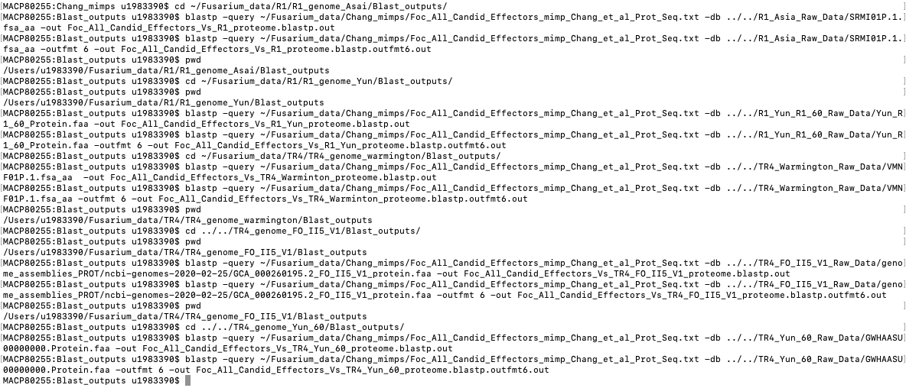

# Original Mimp Identification (BLASTN)

Mimps based on Chang paper

 

Paper bookmarked on chrome under /Papers/Pathogenicity genes/MITES and mimps/ 

 

Received fasta sequences from Dr Chang, following email (subject: 13 reference mimp sequences help regarding your recent publication). 

 

3/3/2020

Merged the independent sequences given into a fasta containing all 14 mimps:

Focub_all_Chang_mimps.faa

Also created a folder contains all mimps with number 12 removed, as 12 and 8 are identical. 

Focub_mimp12rm_Chang_mimps.faa

 

 

**Blastn** 

 

Following fasta generation, BLASTn was performed using the 13 reference mimp sequences Chang sourced from Van Dam. These sequences were blasted against the TR4_Warmington genome, and the R1_Aisa genome. 

 

**Warmingtion as subjectÂ** 

All mimps as query 

 

blastn -query ~/Fusarium_data/Chang_mimps/cubense_mimps_public/Focub_all_Chang_mimps.faa -db ../../TR4_Warmington_Raw_Data/VMNF01.1.fsa_nt -perc_identity 90.00 -out cubense_all_mimps_public_Vs_TR4_Warmingtion_genome.blastn.out

 

Mimp 12 rm from query 

 

**Asia as subjectÂ** 

All as query

 

blastn -query ~/Fusarium_data/Chang_mimps/cubense_mimps_public/Focub_all_Chang_mimps.faa -db ../../R1_Asia_Raw_Data/SRMI01.1.fsa_nt -perc_identity 90.00 -out cubense_all_mimps_public_Vs_R1_Asia_genome.blastn.out

 

Mimp 12 rm from query 

 

blastn -query ~/Fusarium_data/Chang_mimps/cubense_mimps_public/Focub_mimp12rm_Chang_mimps.faa -db ../../R1_Asia_Raw_Data/SRMI01.1.fsa_nt -perc_identity 90.00 -out cubense_mimp_12_rm_public_Vs_R1_Asia_genome.blastn.out

 

**Yun_58_TR4 as a subjectÂ** 

All as query 

blastn -query ~/Fusarium_data/Chang_mimps/cubense_mimps_public/Focub_all_Chang_mimps.faa -db ../../TR4_Yun_58_Raw_Data/GWHAASU00000000.genome.fasta -perc_identity 90.00 -out cubense_all_mimps_public_Vs_TR4_YUN_58_genome.blastn.out

 

Mimp 12 rm from query 

blastn -query ~/Fusarium_data/Chang_mimps/cubense_mimps_public/Focub_mimp12rm_Chang_mimps.faa -db ../../TR4_Yun_58_Raw_Data/GWHAASU00000000.genome.fasta -perc_identity 90.00 -out cubense_mimp_12_rm_public_Vs_TR4_YUN_58_genome.blastn.out

 

**Yun_60_R1 as a subjectÂ** 

All as query 

-query ~/Fusarium_data/Chang_mimps/cubense_mimps_public/Focub_all_Chang_mimps.faa -db ../../R1_Yun_R1_60_Raw_Data/Yun_R1_60.faa -perc_identity 90.00 -out cubense_all_mimps_public_Vs_R1_YUN_60_genome.blastn.out

 

Mimp 12 rm from query 

blastn -query ~/Fusarium_data/Chang_mimps/cubense_mimps_public/Focub_mimp12rm_Chang_mimps.faa -db ../../R1_Yun_R1_60_Raw_Data/Yun_R1_60.faa -perc_identity 90.00 -out cubense_mimp_12_rm_public_Vs_R1_YUN_60_genome.blastn.out

 

**FO_II5_V1 as a subjectÂ** 

All as query 

 blastn -query ~/Fusarium_data/Chang_mimps/cubense_mimps_public/Focub_all_Chang_mimps.faa -db ../../TR4_FO_II5_V1_Raw_Data/genome_assemblies_NUCL/ncbi-genomes-2020-02-25/GCF_000260195.1_FO_II5_V1_genomic.fna -perc_identity 90.00 -out cubense_all_mimps_public_Vs_TR4_FO_II5_V1_genome.blastn.out

 

Mimp 12 rm from query 

blastn -query ~/Fusarium_data/Chang_mimps/cubense_mimps_public/Focub_mimp12rm_Chang_mimps.faa -db ../../TR4_FO_II5_V1_Raw_Data/genome_assemblies_NUCL/ncbi-genomes-2020-02-25/GCF_000260195.1_FO_II5_V1_genomic.fna -perc_identity 90.00 -out cubense_mimp_12_rm_public_Vs_TR4_FO_II5_V1_genome.blastn.out

 

Command for calculating the total matches 

E.g. 

MACP80255:Blast_outputs u1983390$ grep -c ">" cubense_all_mimps_public_Vs_R1_Asia_genome.blastn.out

27

 

Output from grep commands: 

 

Chang et al paper - 21 TR4 mimps, and 20 R1 mimps 

|

              |**Race**|**All mimps**|**With mimp 12 rm**|
|--------------|--------|-------------|-------------------|
|**Warmington**|TR4     |32           |29                 |
|**Asia**      |R1      |27           |23                 |
|**Yun_TR4_58**|TR4     |32           |29                 |
|**FO_II5_V1** |4       |53           |46                 |
|**Yun_R1_60** |R1      |23           |17                 |

 

BLASTp was performed using the **Candidate effector protein sequences** **provided in supplementary table 3 of the Chang paper**. Outputs were saved in the Blast_output folders corresponding to each genome. Not cut off was used. 

 

Commands:

 

NOTE: realised I had saved Run TR4 as 60, when its supposed to be 58, have since changed folder name but not file names. 

 

The outfmt 6 outputs have been saved in an excel file:  ~/Documents/Lab_Book/Blast/Chang_Candidate_Effectors_vs_genomes.blastp.xlsx 

 

17/3/2020

 

Extracting 2500 bases upstream and downstream of cubense all mimps from genome sequences.

Used MACP80255/:Users/u1983390/Scripts/[Extract_flanking_region.sh](http://extract_flanking_region.sh/)

A new folder was created in each [RACE]_genome_[NAME] folder called blastn_+2500_bases

e.g.

MACP80255:Scripts u1983390$ cd ~/Fusarium_data/TR4/TR4_genome_Yun_58/

MACP80255:TR4_genome_Yun_58 u1983390$ mkdir blastn_+2500_bases

MACP80255:TR4_genome_Yun_58 u1983390$ ls

Blast_outputs                      blastn_+2500_bases

The [Extract_flanking_region.sh](http://extract_flanking_region.sh/) script was then modified so that the directories were appropriate for each genome. 

 

[Extract_flanking_region.sh](http://extract_flanking_region.sh/): 

 

#!/bin/bash

 

#Extract flanking region of -500 nt upstream and downstream of BLAST result on genome using perl scripts

#Taken from: [https://www.biostars.org/p/394363/#394366](https://www.biostars.org/p/394363/#394366)

#example for FO_II5_V1 genome

 

 

# I have already done <- makeblastdb -in reference.fa -dbtype nucl # make a BLAST database

samtools faidx ~/Fusarium_data/TR4/TR4_Yun_58_Raw_Data/GWHAASU00000000.genome.fasta # make a FASTA index

 

cut -f 1,2 ~/Fusarium_data/TR4/TR4_Yun_58_Raw_Data/GWHAASU00000000.genome.fasta.fai > GWHAASU00000000.genome.fasta.chrom.sizes # get the chromosome sizes

 

# I have already done <- blastn -db reference -query query.fasta -outfmt 6 -out query.fasta-against-reference.blast # perform BLAST (note use your desired settings)

 

cut -f 2,9,10 ~/Fusarium_data/TR4/ TR4_genome_Yun_58/Blast_outputs/cubense_all_mimps_public_Vs_TR4_YUN_58_genome.blastn.outfmt6.out | awk '{if($2 > $3) {t = $2; $2 = $3; $3 = t; print;} else if($2 < $3) print; }' OFS='\t' |awk '{a=$2-1;print $1,a,$3;}' OFS='\t'|bedtools sort > cubense_all_mimps_public_Vs_TR4_YUN_58_genome.blastn.outfmt6.out.bed # convert BLAST 6 format to BED

 

bedtools slop -i cubense_all_mimps_public_Vs_TR4_YUN_58_genome.blastn.outfmt6.out.bed -g GWHAASU00000000.genome.fasta.chrom.sizes -b 2500 > cubense_all_mimps_public_Vs_TR4_YUN_58_genome.blastn.outfmt6.out.2500.bed # add on 2500 bases upstream and downstream

 

bedtools getfasta -fi ~/Fusarium_data/TR4/TR4_Yun_58_Raw_Data/GWHAASU00000000.genome.fasta -bed cubense_all_mimps_public_Vs_TR4_YUN_58_genome.blastn.outfmt6.out.2500.bed -fo cubense_all_mimps_public_Vs_TR4_YUN_58_genome.blastn.outfmt6.out.2500.fna # get the accompanying bases for BLAST coordinates but 2500 bases upstream and downstream

 

[Extract_flanking_region.sh](http://extract_flanking_region.sh/) was then run.

 

MACP80255:blastn_+2500_bases u1983390$ ~/Scripts/Extract_flanking_region.sh

MACP80255:Blast_outputs u1983390$ cd ../blastn_+2500_bases/

MACP80255:blastn_+2500_bases u1983390$ ls

GWHAASU00000000.genome.fasta.chrom.sizes

cubense_all_mimps_public_Vs_TR4_YUN_58_genome.blastn.outfmt6.out.2500.bed

cubense_all_mimps_public_Vs_TR4_YUN_58_genome.blastn.outfmt6.out.2500.fna

cubense_all_mimps_public_Vs_TR4_YUN_58_genome.blastn.outfmt6.out.bed

 

This script only worked when the s_start was greater than the s_end in BLASTN outfmt 6. Therefore, the directories containing files generated with [Extract_flanking_region.sh](http://extract_flanking_region.sh/), along with the files inside, were deleted using rm -r blastn_+2500_bases. New folders were made within the Blast_output folder entitled cubense_all_mimps_+2500_bases, where a new script entitled [new_fasta_from_blastn.sh](http://new_fasta_from_blastn.sh/) was run.  Pieces of script that were changed from [Extract_flanking_region.sh](http://extract_flanking_region.sh/) are indicated in red.

 

[New_fasta_from_blastn.sh](http://new_fasta_from_blastn.sh/)

#!/bin/bash

 

#Extract flanking region of -500 nt upstream and downstream of BLAST result on genome using perl scripts

#Taken from: [https://www.biostars.org/p/394363/#394366](https://www.biostars.org/p/394363/#394366)

#example for FO_II5_V1 genome

 

# makeblastdb -in reference.fa -dbtype nucl

 

samtools faidx ~/Fusarium_data/TR4/TR4_Warmington_Raw_Data/VMNF01.1.fsa_nt

cut -f 1,2 ~/Fusarium_data/TR4/TR4_Warmington_Raw_Data/VMNF01.1.fsa_nt.fai > VMNF01.1.fsa_nt.chrom.sizes

 

# blastn -db reference -query query.fasta -outfmt 6 -out query.fasta-against-reference.blast

 

cut -f 2,9,10 ~/Fusarium_data/TR4/TR4_genome_warmington/Blast_outputs/cubense_all_mimps_public_Vs_TR4_Warmingtion_genome.blastn.outfmt6.out |awk '{if ($2>$3)print $1,$3,$2,".",".","-";else print $1,$2,$3,".",".","+";}' OFS='\t' |awk '{a=$2-1;print $1,a,$3,$4,$5,$6;}' OFS='\t'|bedtools sort > cubense_all_mimps_public_Vs_TR4_Warmingtion_genome.blastn.outfmt6.out.bed

 

bedtools slop -i cubense_all_mimps_public_Vs_TR4_Warmingtion_genome.blastn.outfmt6.out.bed -g VMNF01.1.fsa_nt.chrom.sizes -b 2500 > cubense_all_mimps_public_Vs_TR4_Warmingtion_genome.blastn.outfmt6.out.2500.bed

 

bedtools getfasta -s -fi ~/Fusarium_data/TR4/TR4_Warmington_Raw_Data/VMNF01.1.fsa_nt -bed cubense_all_mimps_public_Vs_TR4_Warmingtion_genome.blastn.outfmt6.out.2500.bed -fo cubense_all_mimps_public_Vs_TR4_Warmingtion_genome.blastn.outfmt6.out.2500.fasta

 

The same script was then used to create fastas with 0 bases printed either side, so only sequence found in the original BLASTN hit subject was in a fasta. This was performed by changing the -b flag in bedtools slop to -b 0  and altering the *.2500.* to *.0.* for each genome. The output fastas were saved in the blast outputs folder in directories called cubense_all_mimps_blastn_hit_fasta.
