# Pangloss Run

`Pangloss`

Run 1 - 16:23, 28/2/2020 

Command line :  nohup ./pangloss.sh 1>pangloss.log 2>pangloss.err &

[Pangloss_run1_notes](./file/Pangloss_run1_notes)

    Checked 3/2/2020 - seems to have run ok but no graphs in output - believe this is because graph making tools in R not installed. These tools were enabled by editing the Pangloss R scripts in the Pangloss-Master file in my U area on Vettel - programme re-run on 3/3/2020 at 12:03. 

Run 2/3 12:03, 3/2/2020

Error:  it's complaining about something being the wrong data type (the part that says "invalid literal for int() with base 10" suggests it's expecting an integer, but is getting a string "Circular=F")

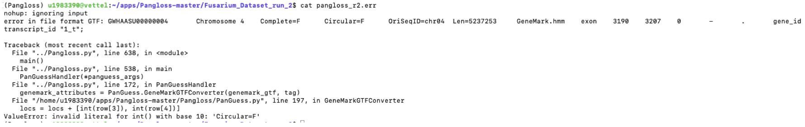

Circular=F output in .gtf file. The .gtf format should be 

[https://www.ensembl.org/info/website/upload/gff.html](https://www.ensembl.org/info/website/upload/gff.html)

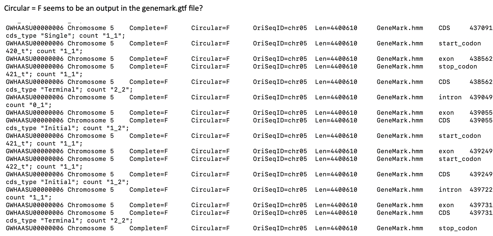

Thought spacing within the header may be the issue. 

Cp folder Fusarium_Data_run_2 to Fusarium_Data_just_Yun to see if fixing the Run files would resolve the issue. 

    Replaced spaces with underscores using the bbtools [rename.sh](http://rename.sh/) script which is already                    on vettel. This is the command format:

[reformat.sh](http://reformat.sh/) in=Yun_TR4_58.faa out=Yun_TR4_58_HeaderWithUnderscore.faa add-               underscore

Repeated for Fun_R1_60.faa

Edited genomes.txt accordingly. 

Ran again. 

Source activate Pangloss 

nohup ./pangloss.sh 1>pangloss_jy_4.log 2>pangloss_jy_4.err &

New error:

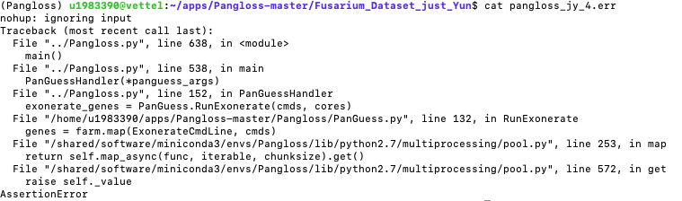

Run 4 5/2/2020

In /home/u1983390/apps/Pangloss-master/Fusarium_Dataset_run_2/genomes edited genomes.txt removing the Yun genomes, to see if it is just the formatting of those genomes. 

Run at 09:45 

Accidentally ran twice! 

Using nohup ./pangloss.sh 1>pangloss_r4.1.log 1>pangloss_run_4.1.err & first. 

Then re-entering - 

nohup ./pangloss.sh 1>pangloss_r4.1.log 2>pangloss_run_4.1.err &. Without realising the first attempt was running!

Top -u u1983390 output - seems to be running ok! 

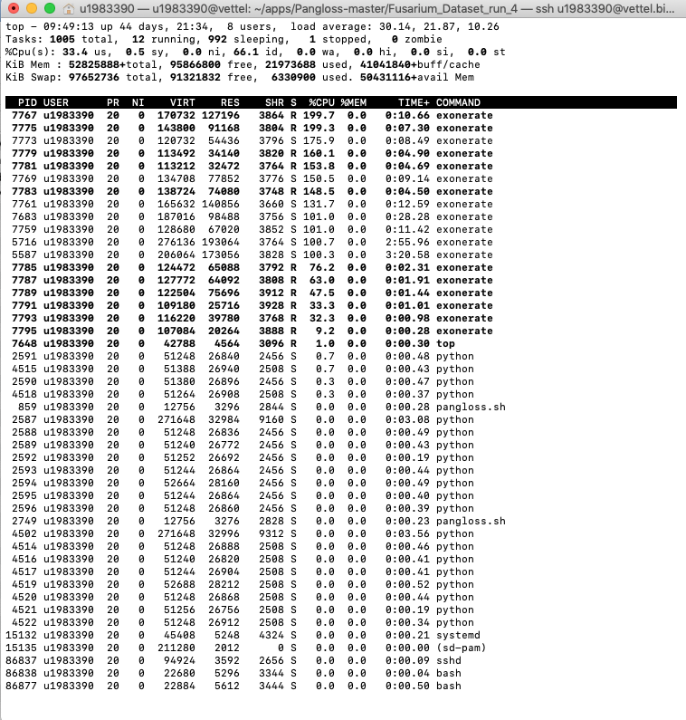

Checked: 16:30. Pangloss no longer running - error message

(Pangloss) **u1983390@vettel**:**~/apps/Pangloss-master/Fusarium_Dataset_run_4**$ cat pangloss_run_4.1.err 

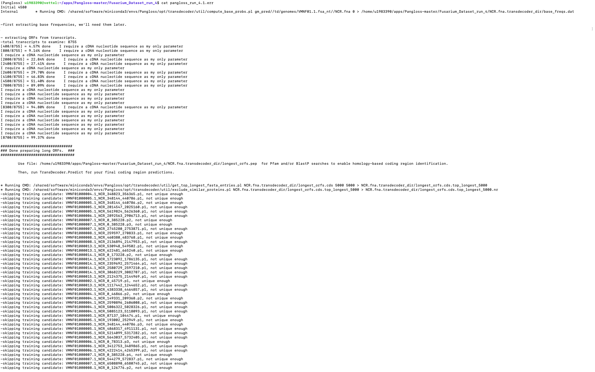

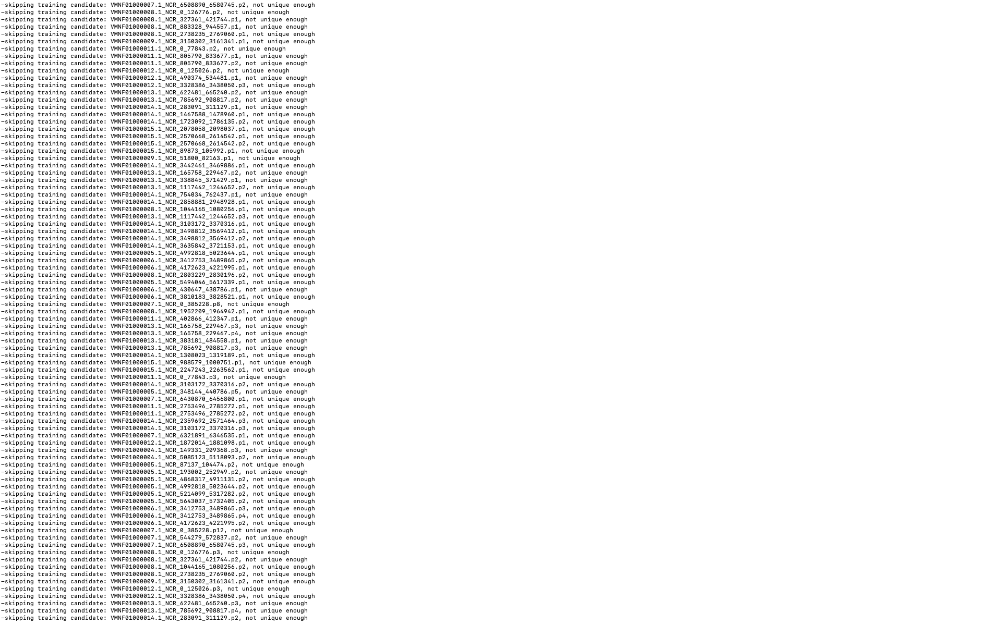

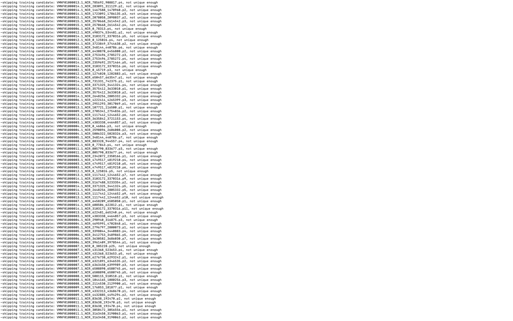

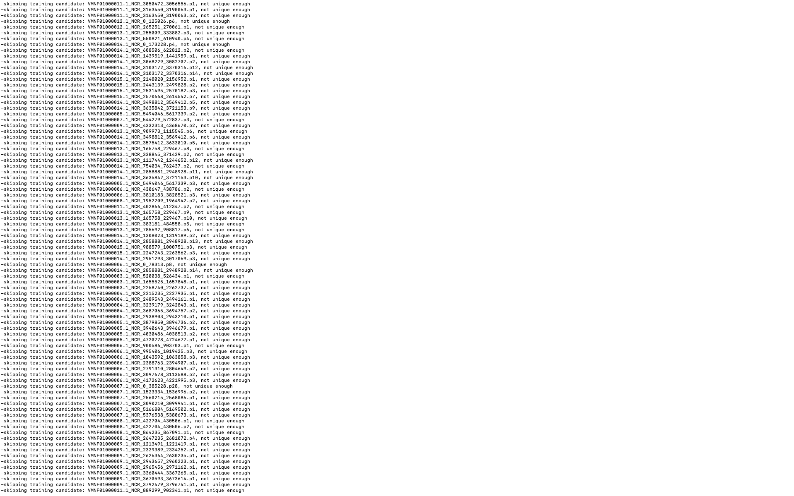

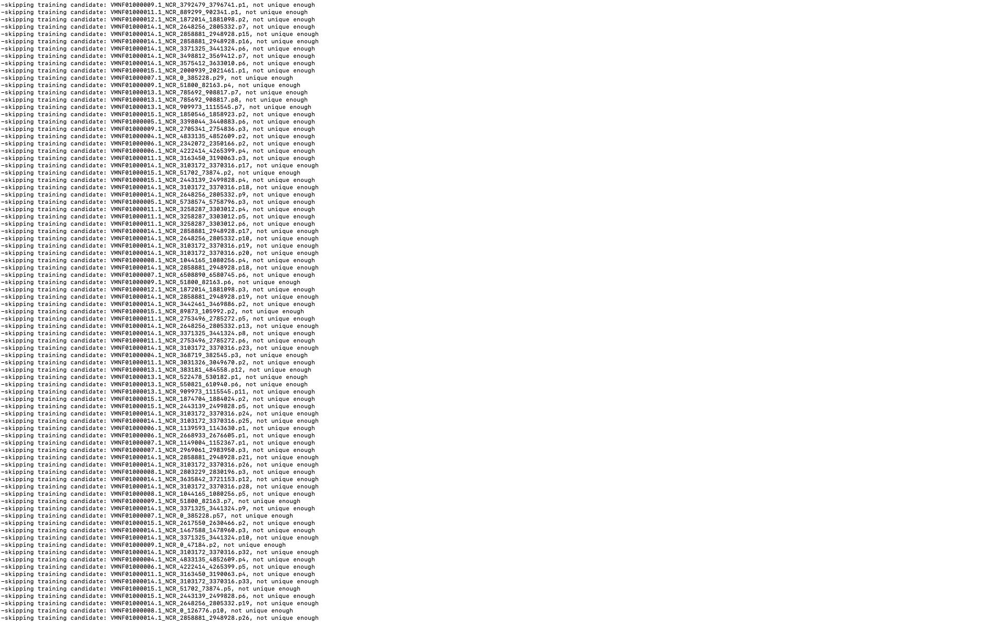

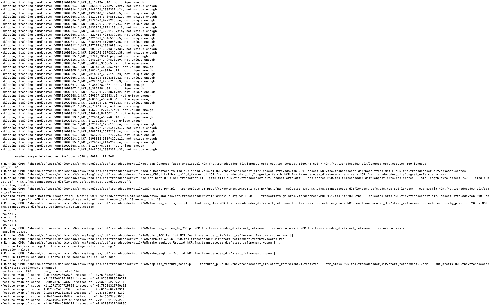

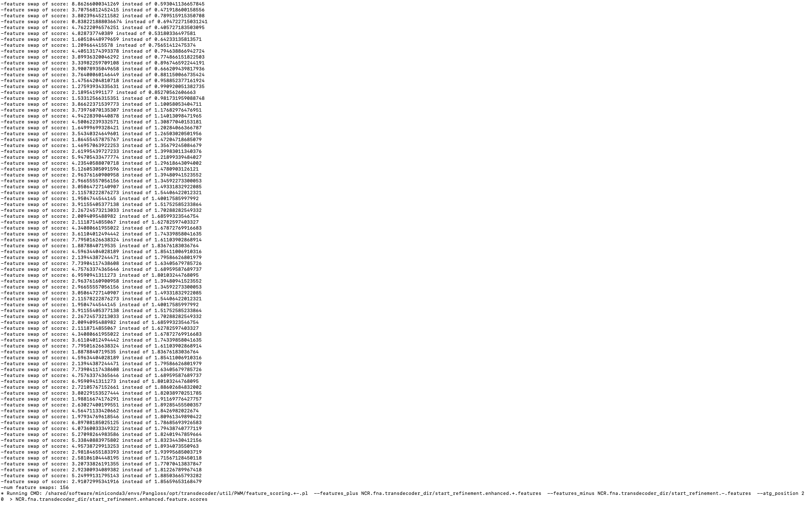

Checked error message:  

Running CMD: /shared/software/miniconda3/envs/Pangloss/opt/transdecoder/util/PWM/make_seqLogo.Rscript NCR.fna.transdecoder_dir/start_refinement.-.pwm || :

Error in library(seqLogo) : there is no package called ‘seqLogo’

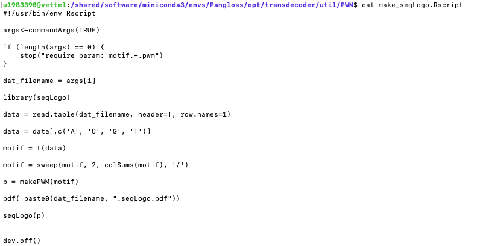

Would like to try to add:

if (!requireNamespace("BiocManager", quietly = TRUE))

    install.packages("BiocManager")

BiocManager::install("seqLogo”)

To make_seqLogo.Rscript however, make_seqLogo.Rscript is on the shared drive, so I can’t edit the file. 

Probably not essential; as Warmington genome was successful, error occurred using 

Trouble shooting 10/3/2020

Believe error may be in input FASTA, swapped section heads of Test data for my headers:

Commands:

To copy the Fusarium_dataset for trial of swapping headers:

**u1983390@vettel**:**~/apps/Pangloss-master**$ cp -r Fusarium_Dataset  Fusarium_Dataset_my_heads_swapped_for_test_heads

**u1983390@vettel**:**~/apps/Pangloss-master**$ cd Fusarium_Dataset_my_heads_swapped_for_test_heads

**1983390@vettel**:**~/apps/Pangloss-master/Fusarium_Dataset_my_heads_swapped_for_test_heads**$ ls

**data_run_1**              **genemark_run_1.gtf**  **gmhmm_run_1.mod**  **goslim_generic.obo**  **pangloss_run_1.err**                          **Pangloss_Run_2020-02-28_15:43:25.616796.log**  **Pangloss_Run_2020-02-28_16:20:18.803099.log**  **run.cfg**                    **testconfig.ini**

**fusariumconfig.ini**      **genomes**            **gm_pred**          **info_run_1**          **pangloss_run_1.log**                          **Pangloss_Run_2020-02-28_16:14:26.957703.log**  [pangloss.sh](http://pangloss.sh)                                  [saccharomycetales_busco.sh](http://saccharomycetales_busco.sh)

**fusariumconfig.ini.save**  **gmes_run_1.log**      **go.obo**          **output_run_1**        **Pangloss_Run_2020-02-28_15:32:51.071681.log**  **Pangloss_Run_2020-02-28_16:19:02.993812.log**  **run_1**                                        [sordariomycetes_busco.sh](http://sordariomycetes_busco.sh)

**u1983390@vettel**:**~/apps/Pangloss-master/****Fusarium_Dataset_my_heads_swapped_for_test_heads**$ cd genomes/

**u1983390@vettel**:**~/apps/Pangloss-master/****Fusarium_Dataset_my_heads_swapped_for_test_heads****/genomes**$ ls 

**AGND01.1.fsa_nt**  **AMGP01.1.fsa_nt**  **dubious.faa**  **genomes.txt**  **lycopersici_reference.faa**  **reference.faa**  **SRMI01.1.fsa_nt**  **Strain_A.fna**  **Strain_B.fna**  **VMNF01.1.fsa_nt**  **Yun_R1_60.faa**  **Yun_TR4_58.faa**

**u1983390@vettel**:**~/apps/Pangloss-master/Fusarium_Dataset_1_Chr_test/genomes**$ cd ..

I removed the folders and files generated from the previous run

**u1983390@vettel**:**~/apps/Pangloss-master/Fusarium_Dataset_1_Chr_test**$ rm -r data_run_1/

**u1983390@vettel**:**~/apps/Pangloss-master/Fusarium_Dataset_1_Chr_test**$ rm genemark_run_1.gtf 

**u1983390@vettel**:**~/apps/Pangloss-master/Fusarium_Dataset_1_Chr_test**$ rm gmhmm_run_1.mod 

**u1983390@vettel**:**~/apps/Pangloss-master/Fusarium_Dataset_1_Chr_test**$ rm run.cfg 

**u1983390@vettel**:**~/apps/Pangloss-master/Fusarium_Dataset_1_Chr_test**$ rm fusariumconfig.ini.save 

**u1983390@vettel**:**~/apps/Pangloss-master/Fusarium_Dataset_1_Chr_test**$ rm -r gm_pred/

**u1983390@vettel**:**~/apps/Pangloss-master/Fusarium_Dataset_1_Chr_test**$ rm -r info_run_1/

**u1983390@vettel**:**~/apps/Pangloss-master/Fusarium_Dataset_1_Chr_test**$ rm gmes_run_1.log 

**u1983390@vettel**:**~/apps/Pangloss-master/Fusarium_Dataset_1_Chr_test**$ rm -r output_run_1/

**u1983390@vettel**:**~/apps/Pangloss-master/Fusarium_Dataset_1_Chr_test**$ rm run_1/

rm: cannot remove 'run_1/': Is a directory

**u1983390@vettel**:**~/apps/Pangloss-master/Fusarium_Dataset_1_Chr_test**$ rm -r run_1/

I removed genome Yun_R1_60.faa and Yun_TR4_58.faa from genomes.txt 

**u1983390@vettel**:**~/apps/Pangloss-master/Fusarium_Dataset_1_Chr_test/genomes**$ nano genomes.txt 

**u1983390@vettel**:**~/apps/Pangloss-master/Fusarium_Dataset_1_Chr_test/genomes**$ cat genomes.txt 

genomes/VMNF01.1.fsa_nt

genomes/AGND01.1.fsa_nt

genomes/AMGP01.1.fsa_nt

genomes/SRMI01.1.fsa_nt

Headings within the fasta Files VMNF01.1.fsa_nt  and AGND01.1.fsa_nt were swapped using the following commands

awk -F '[/^> ,]' 'NF>1{print ">NC_00606"++i".1 Yarrowia lipolytica CLIB122 chromosome A complete sequence";next} {print $1}' VMNF01.1.fsa_nt | awk NF >VMNF01.1.fsa_nt_swapped_Strain_A.fna

awk -F '[/^> ,]' 'NF>1{print ">UTQH010000"++i".1 Yarrowia lipolytica genome assembly, contig: YALIH222S16, whole genome shotgun sequence";next} {print $1}' AGND01.1.fsa_nt | awk NF >AGND01.1.fsa_nt_swapped_Strain_B.fna

**u1983390@vettel**:**~/apps/Pangloss-master/Fusarium_Dataset_my_heads_swapped_for_test_heads/genomes**$ head -n 10 AGND01.1.fsa_nt_swapped_Strain_B.fna 

> UTQH0100001 .1 Yarrowia lipolytica genome assembly, contig: YALIH222S16, whole genome shotgun sequence

TCGCCGCTCCAATGTGCATGGGGTGGCGTAGTATTTTAAAATATTCCTGTCACTTTAGAGACTGGACTTC

AATCCTACCCTACTGCTCCAACCTTGCTACGCACTGCCTACTGCACATTAAATCACCCAACATCACAATG

CCCCACCCAATCATCTTCAATGGCAGTCTCGGCCTAGGCCTCATGATAGTCGGCCTCGGTCTCAACGCCA

CCTTCCGCCCAAACGACCATCTTCAACGCCTCGAATTCCCCGTTCCAGCTGAACCTTTGGCAAAAAAGTT

CAGTCTCGCGCTCATGAGGATTTGGGGCATTCGCAACATCACTGTCGGCGCGTTGATTTCACTCATCTGG

ACCACGGGAGATGAGAAGCTGATGGCCAAGGCCTTGAGCGCAGCGCTGGCTATGCCAATTACTGATGGGT

TTGTGAGCCGAATCATCATCGGAGGTGGAGAGACGCAGCATTGGGTGTTTCCTCCTTTGCTTGTGGTGAT

GATTGCTGGGTTGTTTGGATACTTTTAACGGTGGATCTAGTTTGGCCACTATGATGTGACCGCGGGCGGA

CTACGTGTATCTAATGGTAATCATACTCTTGGAGTGGGGGCATCTTTCTATTTTATTTCCCTTATAAAAT

**u1983390@vettel**:**~/apps/Pangloss-master/Fusarium_Dataset_my_heads_swapped_for_test_heads/genomes**$ head -n 10 VMNF01.1.fsa_nt_swapped_Strain_A.fna 

>NC_006061.1 Yarrowia lipolytica CLIB122 chromosome A complete sequence

atcacagagcccatctgctagcggtccaggcaagcccggactgcatctacacaggcatcc

ccagtacgctgtcacgccggagcgtgcagtttcgtggaggtcgacgaccactatgaaccc

cccgctgccgaggccggagcctgcaaagctgtacagagggacacgcagtggaagtctgca

agatctgatactgagaggttgctcgcccggtttgtcctcaccctttcaggctcggccgga

tttgctcccttctcatataccctccgagaccgttttagtgggccgcacgccaggactgcc

tcgtgagccactttttattttccgcaaaattcatttgtatgggaaaacaaaaaaatcgac

tcacggccaccaaaccacaaaaccattttgcacgcattttttcaaaagtgcatataccaa

ctatttcgaccaaggcaaatccgatggtggtggtcccgtcgtcatgcgaggtccgtggcg

gccgtgagaggcgattgaagttgactaccgggtagaccacttcgagggttagagctgcct

The genomes.txt file was then edited accordingly 

**u1983390@vettel**:**~/apps/Pangloss-master/Fusarium_Dataset_my_heads_swapped_for_test_heads/genomes**$ cat genomes.txt 

genomes/VMNF01.1.fsa_nt_swapped_Strain_A.fna

genomes/AGND01.1.fsa_nt_swapped_Strain_B.fna

Pangloss was then run at 16:03 10/3/2020 using:

**u1983390@vettel**:**~/apps/Pangloss-master/Fusarium_Dataset_my_heads_swapped_for_test_heads**$ nohup ./pangloss.sh 1>pangloss_swapped_1.log 2>pangloss_swapped_1.err & 

Checked 11/3/2020 

Crashed with same error  (pangloss_swapped_1.err)

Exception in thread Thread-6:

Traceback (most recent call last):

  File "/shared/software/miniconda3/envs/Pangloss/lib/python2.7/threading.py", line 801, in __bootstrap_inner

    self.run()

  File "/shared/software/miniconda3/envs/Pangloss/lib/python2.7/threading.py", line 754, in run

    self.__target(*self.__args, **self.__kwargs)

  File "/shared/software/miniconda3/envs/Pangloss/lib/python2.7/multiprocessing/pool.py", line 392, in _handle_results

    task = get()

TypeError: __init__() takes at least 3 arguments (1 given)

Run 11/3/2020 

removing AGND01.fsa_nt from genomes.txt

**u1983390@vettel**:**~/apps/Pangloss-master**$ cp -r Fusarium_Dataset Fusarium_Dataset_with_Yun_and_AGND01_rm 

**u1983390@vettel**:**~/apps/Pangloss-master**$ cd Fusarium_Dataset_with_Yun_and_AGND01_rm

**u1983390@vettel**:**~/apps/Pangloss-master/Fusarium_Dataset_with_Yun_and_AGND01_rm**$ ls -lht 

total 60M

drwxrwxr-x  4 u1983390 u1983390 4.0K Mar 11 15:22 **output_run_1**

drwxrwxr-x 10 u1983390 u1983390 4.0K Mar 11 15:22 **run_1**

drwxrwxr-x  2 u1983390 u1983390 4.0K Mar 11 15:22 **info_run_1**

drwxrwxr-x  3 u1983390 u1983390 4.0K Mar 11 15:22 **data_run_1**

-rw-rwxr--  1 u1983390 u1983390  26M Mar 11 15:22 **genemark_run_1.gtf**

-rw-rwxr--  1 u1983390 u1983390 958K Mar 11 15:22 **gmhmm_run_1.mod**

-rw-rwxr--  1 u1983390 u1983390  55K Mar 11 15:22 **gmes_run_1.log**

-rw-rwxr--  1 u1983390 u1983390  16K Mar 11 15:22 **run.cfg**

-rw-rwxr--  1 u1983390 u1983390 2.2K Mar 11 15:22 **fusariumconfig.ini.save**

-rw-rwxr--  1 u1983390 u1983390 1.2K Mar 11 15:22 **Pangloss_Run_2020-02-28_16:20:18.803099.log**

drwxrwxr-x  3 u1983390 u1983390 4.0K Mar 11 15:22 **gm_pred**

-rw-rwxr--  1 u1983390 u1983390   57 Mar 11 15:22 **Pangloss_Run_2020-02-28_15:43:25.616796.log**

-rw-rwxr--  1 u1983390 u1983390  205 Mar 11 15:22 **Pangloss_Run_2020-02-28_16:14:26.957703.log**

-rw-rwxr--  1 u1983390 u1983390  391 Mar 11 15:22 **Pangloss_Run_2020-02-28_16:19:02.993812.log**

-rw-rwxr--  1 u1983390 u1983390  709 Mar 11 15:22 **pangloss_run_1.err**

-rw-rwxr--  1 u1983390 u1983390   57 Mar 11 15:22 **Pangloss_Run_2020-02-28_15:32:51.071681.log**

-rw-rwxr--  1 u1983390 u1983390  188 Mar 11 15:22 [sordariomycetes_busco.sh](http://sordariomycetes_busco.sh)

-rw-rwxr--  1 u1983390 u1983390 2.1K Mar 11 15:22 **pangloss_run_1.log**

-rwxrwxr-x  1 u1983390 u1983390  162 Mar 11 15:22 [pangloss.sh](http://pangloss.sh)

-rw-rwxr--  1 u1983390 u1983390 2.2K Mar 11 15:22 **fusariumconfig.ini**

-rw-rwxr--  1 u1983390 u1983390 2.1K Mar 11 15:22 **testconfig.ini**

-rw-rwxr--  1 u1983390 u1983390  180 Mar 11 15:22 [saccharomycetales_busco.sh](http://saccharomycetales_busco.sh)

-rw-rwxr--  1 u1983390 u1983390 125K Mar 11 15:22 **goslim_generic.obo**

-rw-rwxr--  1 u1983390 u1983390  33M Mar 11 15:22 **go.obo**

drwxrwxr-x  2 u1983390 u1983390 4.0K Mar 11 15:22 **genomes**

**u1983390@vettel**:**~/apps/Pangloss-master/Fusarium_Dataset_with_Yun_and_AGND01_rm**$ rm -r output_run_1/

**u1983390@vettel**:**~/apps/Pangloss-master/Fusarium_Dataset_with_Yun_and_AGND01_rm**$ rm -r run

run_1/   run.cfg  

**u1983390@vettel**:**~/apps/Pangloss-master/Fusarium_Dataset_with_Yun_and_AGND01_rm**$ rm -r run

run_1/   run.cfg  

**u1983390@vettel**:**~/apps/Pangloss-master/Fusarium_Dataset_with_Yun_and_AGND01_rm**$ rm -r run_1/

**u1983390@vettel**:**~/apps/Pangloss-master/Fusarium_Dataset_with_Yun_and_AGND01_rm**$ rm -r info_run_1/

**u1983390@vettel**:**~/apps/Pangloss-master/Fusarium_Dataset_with_Yun_and_AGND01_rm**$ rm -r data_run_1/

**u1983390@vettel**:**~/apps/Pangloss-master/Fusarium_Dataset_with_Yun_and_AGND01_rm**$ rm genemark_run_1.gtf 

**u1983390@vettel**:**~/apps/Pangloss-master/Fusarium_Dataset_with_Yun_and_AGND01_rm**$ rm gmhmm_run_1.mod 

**u1983390@vettel**:**~/apps/Pangloss-master/Fusarium_Dataset_with_Yun_and_AGND01_rm**$ rm gmes_run_1.log 

**u1983390@vettel**:**~/apps/Pangloss-master/Fusarium_Dataset_with_Yun_and_AGND01_rm**$ rm run.cfg 

**u1983390@vettel**:**~/apps/Pangloss-master/Fusarium_Dataset_with_Yun_and_AGND01_rm**$ rm fusariumconfig.ini.save 

**u1983390@vettel**:**~/apps/Pangloss-master/Fusarium_Dataset_with_Yun_and_AGND01_rm**$ rm -r gm_pred/

**u1983390@vettel**:**~/apps/Pangloss-master/Fusarium_Dataset_with_Yun_and_AGND01_rm/genomes**$ cat genomes.txt 

genomes/Yun_TR4_58.faa

genomes/VMNF01.1.fsa_nt

genomes/AGND01.1.fsa_nt

genomes/Yun_R1_60.faa

genomes/AMGP01.1.fsa_nt

genomes/SRMI01.1.fsa_nt

**u1983390@vettel**:**~/apps/Pangloss-master/Fusarium_Dataset_with_Yun_and_AGND01_rm/genomes**$ nano genomes.txt 

**u1983390@vettel**:**~/apps/Pangloss-master/Fusarium_Dataset_with_Yun_and_AGND01_rm/genomes**$ cat genomes.txt 

genomes/VMNF01.1.fsa_nt

genomes/AMGP01.1.fsa_nt

genomes/SRMI01.1.fsa_nt

**u1983390@vettel**:**~/apps/Pangloss-master/Fusarium_Dataset_with_Yun_and_AGND01_rm/genomes**$ 
